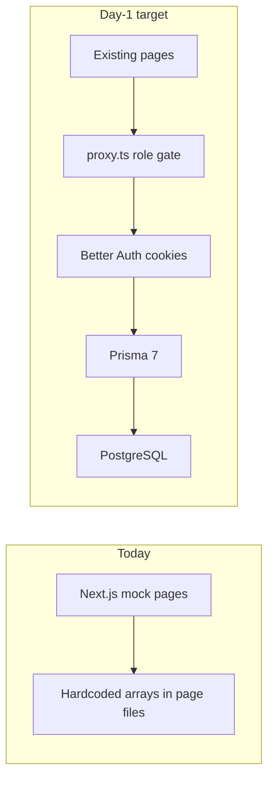

# HRMS Feature Gap and 1-Day Tech Stack Plan

> Using the writing-plans skill for the implementation plan. Spec source: the Odoo Hackathon 2026 HRMS problem statement as independently documented by multiple teams (auth, dual dashboards, attendance, leave workflow, payroll, responsive UI). **The PDF is not in this repo or your Downloads folder.** If your PDF differs, attach it before implementation.

**Current reality:** this repo is a polished **frontend-only mock**. There is no `app/api`, no `middleware.ts`/`proxy.ts`, no database, and no session. Login/sign-up forms do not submit. Role is inferred from the URL (`/admin` vs `/employee`) in [components/layout/sidebar.tsx](components/layout/sidebar.tsx), so anyone can open the admin portal.



---

## 1. Feature gap vs the problem statement

Treat **UI-only mock** as "not implemented" for judging. Interactive local state that resets on refresh is still not implemented.

### Already implemented (UI shell only — must be wired)

These screens exist and match the spec's modules, but they use hardcoded data.

- Dual portals: Admin layout ([app/admin/layout.tsx](app/admin/layout.tsx)) and Employee layout ([app/employee/layout.tsx](app/employee/layout.tsx))
- Login / sign-up chrome ([app/login/page.tsx](app/login/page.tsx), [app/sign-up/page.tsx](app/sign-up/page.tsx)) — no auth
- Admin dashboard metrics/charts ([components/section/dashboard.tsx](components/section/dashboard.tsx))
- Employee directory + detail ([app/admin/people/employees/page.tsx](app/admin/people/employees/page.tsx), [app/admin/people/employees/[id]/page.tsx](app/admin/people/employees/[id]/page.tsx))
- Admin attendance log table ([app/admin/people/attendance/page.tsx](app/admin/people/attendance/page.tsx))
- Admin leave table with Approve/Reject menu items that **do not persist** (filters even read `initialLeaveRequests`, not state)
- Admin payroll editor UI ([app/admin/hr/payroll/page.tsx](app/admin/hr/payroll/page.tsx))
- Employee dashboard clock-in toggle (local React state only) ([app/employee/page.tsx](app/employee/page.tsx))
- Employee profile (static object) ([app/employee/profile/page.tsx](app/employee/profile/page.tsx))
- Employee attendance timesheet (static) ([app/employee/attendance/page.tsx](app/employee/attendance/page.tsx))
- Employee leave form (appends to local state; duration/dates hardcoded) ([app/employee/leave/page.tsx](app/employee/leave/page.tsx))
- Dark/light toggle via `localStorage`

### Required by the spec — not implemented (backend + missing UX)

| Spec item                                                            | Gap                                                                                 |
| -------------------------------------------------------------------- | ----------------------------------------------------------------------------------- |
| Sign up with Employee ID, email, password, role + email verification | Sign-up is org name/email only; no Employee ID, no role, no verification, no submit |
| Role-based redirects                                                 | No session; `/admin` and `/employee` are public                                     |
| Admin can switch/view a selected employee's records                  | No selected-employee context; only a separate profile page                          |
| Attendance check-in/check-out persisted                              | Dashboard toggle is in-memory; no unique-per-day row                                |
| Statuses Present / Absent / Half-day / Leave                         | UI uses On Time / Late / Remote                                                     |
| Daily + weekly attendance views                                      | Weekly chart is fake; no daily summary tied to today                                |
| Leave calendar date-range + Present/Absent markers                   | Date inputs exist; **no monthly calendar with attendance dots**                     |
| Leave types Paid / Sick / Unpaid                                     | UI uses Annual / Sick / Casual                                                      |
| Admin comments on approve/reject                                     | Buttons exist; no comment field and no write                                        |
| Employee **read-only payroll**                                       | **Missing page entirely** from employee nav                                         |
| Admin editable salary structure                                      | Rich mock UI; not saved                                                             |
| RBAC that employees cannot see others' data                          | URL-only; no RLS, no server checks                                                  |
| Responsive evaluation bar                                            | Desktop-first sidebar; no mobile nav/bottom bar                                     |

### Additionally implemented beyond the spec (keep as mock for day 1)

Do **not** spend the 1-day backend budget wiring these.

- Marketing landing ([app/page.tsx](app/page.tsx) + [components/landing/hero.tsx](components/landing/hero.tsx))
- Department CRUD UI ([app/admin/people/department/page.tsx](app/admin/people/department/page.tsx))
- Recruitment kanban ([app/admin/hr/recruitment/page.tsx](app/admin/hr/recruitment/page.tsx))
- Performance "Coming Soon" ([app/admin/hr/performance/page.tsx](app/admin/hr/performance/page.tsx))
- AI Analytics "Coming Soon" ([app/admin/analytics/page.tsx](app/admin/analytics/page.tsx))
- Notifications inboxes (admin + employee)
- Settings / fake session revoke
- Employee tasks checklist, announcements, holidays
- Payroll "run payroll" / bonus approval chrome
- Export CSV buttons (non-functional)
- Vercel Analytics already in [package.json](package.json)

**Day-1 rule:** extras stay visible so the product looks large; they stay mock. Core spec modules become real.

---

## 2. Recommended stack (production patterns, hackathon scale)

Keep the existing Next.js 16 UI. Use **PostgreSQL + Prisma 7** inside Next.js Server Actions. One app deploy (Vercel) + one Postgres (Neon). No separate Express API.

### Prisma vs Drizzle — decision for this project

**Use Prisma 7. Do not use Drizzle for this HRMS.**

Both are production-ready in 2026. The old Prisma objections (Rust binary, Windows install, Vercel cold starts) are largely gone in Prisma 7 (TypeScript/WASM client + `@prisma/adapter-pg`). The choice is DX vs SQL-control, not “which one works.”

| Need in this repo                                         | Prisma 7                                   | Drizzle                                  |
| --------------------------------------------------------- | ------------------------------------------ | ---------------------------------------- |
| Four related tables (employee → attendance/leave/payroll) | Nested `include` / `upsert` in one call    | Join + `$infer` by hand, more code       |
| Unique `(user_id, date)`, enums, generated `net_salary`   | Native in `schema.prisma`                  | Doable, more SQL to write                |
| 1-day seed + judge demo                                   | **Prisma Studio** to inspect/fix data live | Drizzle Studio exists, less familiar     |
| Team already unsure which ORM to pick                     | Schema file reads as documentation         | Rewards people who already think in SQL  |
| Next.js Node runtime (not Cloudflare Edge)                | Fine                                       | Drizzle’s tiny bundle does not help here |
| Better Auth user/session tables                           | First-class Prisma adapter                 | Also has an adapter; no advantage        |

**Why not Drizzle here**

- This app is **relational CRUD**, not a SQL-heavy analytics layer. Drizzle’s strength (you write SQL-shaped queries) is extra typing for check-in, leave approve, payroll upsert.
- Bundle size and Edge cold starts do not matter: we will not run on Cloudflare Workers or Edge Middleware databases. Next.js 16 Server Actions run on Node.
- A confused team ships faster with a `.prisma` schema than with `pgTable` + relations + drizzle-kit quirks (`push` can surprise on policies).
- We are not using Mongo, so Prisma’s “not a document DB” critique is irrelevant.

**When we would switch to Drizzle later:** Edge/Workers, or if we start writing lots of hand-tuned SQL reports. Not day 1.

Use **Prisma 7** (`prisma` + `@prisma/client` + `@prisma/adapter-pg` + `pg`). Singleton client in `lib/db.ts`. Migrations via `prisma migrate`. Seed via `prisma/seed.ts`. Never query Postgres from a Client Component.

### Full stack table

| Layer         | Use                                                                                       | Do not use                                                          | Why not                                                                                                                                                                                                                                                   |
| ------------- | ----------------------------------------------------------------------------------------- | ------------------------------------------------------------------- | --------------------------------------------------------------------------------------------------------------------------------------------------------------------------------------------------------------------------------------------------------- |
| App framework | **Next.js 16 App Router** (already in repo, React 19)                                     | Vite + React SPA, Remix, SvelteKit                                  | Rewriting 18 routes + layouts wastes the day. Next.js gives `proxy.ts` cookie auth, Server Actions, and layouts you already have. React.js alone is a library, not a product stack: you would still add React Router, a bundler, and a separate API host. |
| UI            | **Existing Tailwind 4 + shadcn/Base UI + Recharts**                                       | MUI, Chakra, Ant Design, new component kit                          | Visual rewrite. Spec asked for card/sidebar/table UI; you already have it.                                                                                                                                                                                |
| Backend       | **Next.js Server Actions + Prisma** (same app)                                            | Express/Nest/Django/Flask as a second service                       | Second process, CORS, JWT glue, two deploys. NestJS boilerplate exceeds 1 day.                                                                                                                                                                            |
| Database      | **PostgreSQL** (Neon for deploy, local Postgres for dev)                                  | MongoDB, Firebase RTDB, SQLite file, Supabase                       | HRMS is relational. Mongo forces you to reinvent joins. Team chose not to use Supabase.                                                                                                                                                                   |
| ORM           | **Prisma 7**                                                                              | Drizzle, Knex, raw `pg` only, TypeORM                               | See decision above. Raw `pg` has no typed models. TypeORM is dated and heavier to configure.                                                                                                                                                              |
| Auth          | **Better Auth** (email/password, httpOnly cookies, Prisma adapter)                        | Clerk, custom JWT in `localStorage`, Firebase Auth, rolling our own | Clerk splits identity from Prisma `User`. `localStorage` JWTs are XSS-stealable. Firebase Auth + Postgres is two identity systems. Auth.js is acceptable but more config for the same cookie session.                                                     |
| Authorization | `**requireRole()` in every Server Action\*\* + `proxy.ts` redirects + `where: { userId }` | Client-side role checks only; full Postgres RLS on day 1            | Without Supabase, RLS is extra SQL and easy to get wrong with Prisma. App-level gates on the server are enough for 1 day **if the client never gets `DATABASE_URL`**. Optional later: add RLS as defense in depth.                                        |
| Validation    | **Zod** on Server Actions                                                                 | Yup, Joi, "trust the form"                                          | One schema shared mentally with DB checks; tiny package.                                                                                                                                                                                                  |
| Caching       | Next `revalidatePath` / `revalidateTag`; React `cache()` for `getSession()`; no Redis     | Redis, Memcached, HTTP cache on `/admin/*`                          | Authenticated HR data must not be CDN-cached. At demo scale Postgres is faster than operating Redis.                                                                                                                                                      |
| Logging       | Tiny `lib/logger.ts` (JSON `console` on server) + Vercel logs                             | ELK, Datadog, Loki, Winston clusters                                | Hours of ops for zero demo value. Optional later: Sentry DSN only if already created.                                                                                                                                                                     |
| Client errors | Existing toast + `console.error` without PII                                              | LogRocket/FullStory                                                 | Privacy and setup time.                                                                                                                                                                                                                                   |
| Realtime      | Skip on day 1; `revalidatePath` after mutations                                           | Socket.io, Pusher                                                   | Extra server.                                                                                                                                                                                                                                             |
| Email         | Skip confirm-email for demo; Better Auth email/password only                              | Custom SMTP, SendGrid, Resend                                       | Spec asked for verification; full inbox flow fails live demos.                                                                                                                                                                                            |
| Files         | Skip avatars/uploads day 1 (initials already in UI)                                       | S3, Cloudinary                                                      | Not in core spec.                                                                                                                                                                                                                                         |
| Hosting       | **Vercel** (app) + **Neon** (Postgres)                                                    | Docker/K8s, AWS ECS, self-hosted Nginx                              | You will not ship infra in one day. Neon gives a connection string in minutes.                                                                                                                                                                            |

### Auth design (frontend + server)

- `lib/auth.ts` — Better Auth instance (Prisma adapter, email/password).
- `lib/auth-client.ts` — browser client **only** for login/signup/logout forms.
- `lib/db.ts` — Prisma singleton (Node only).
- Gate: Next.js 16 `proxy.ts` (confirm file convention in `node_modules/next/dist/docs/` before writing). Unauthenticated → `/login`. `role=admin` hitting `/employee/*` → `/admin`. `role=employee` hitting `/admin/*` → `/employee`.
- Sign-up: keep current org form; first user becomes **admin**. Admin creates employees with generated `employee_id` (`ORG-YYYY-NNN`).
- Login: email + password; show Employee ID on profile.
- Logout: replace fake [app/logout/page.tsx](app/logout/page.tsx) with Better Auth `signOut()` then redirect.
- Every mutation: `const session = await auth.api.getSession(...)` then `requireRole(session, "admin" | "employee")`. Employee queries always include `where: { userId: session.user.id }`.

### Caching design

- **Server:** `getSession()` / `getProfile()` wrapped in React `cache()` per request. After check-in, leave apply, approve, payroll save: `revalidatePath` on the affected routes.
- **Client:** keep `"use client"` pages; fetch via Server Actions, not a new React Query layer (setup cost).
- **Do not** set `Cache-Control: public` on authenticated pages.

### Logging design

```ts
// lib/logger.ts — no secrets, no passwords, no salary dumps
logger.info("leave.approved", { leaveId, adminId });
logger.warn("attendance.duplicate_checkin", { userId, date });
```

Vercel request logs cover HTTP. Unique-constraint failures (`P2002`) map to user-facing “already checked in today.”

---

## 3. Data model (day 1)

Four core tables + departments as a lookup (employee UI already has department).

- Better Auth tables: `user`, `session`, `account`, `verification` (generated by the adapter)
- `EmployeeProfile`: `userId` unique FK, `employeeId` unique, `fullName`, `role` (`admin` `employee`), `department`, `jobTitle`, `phone`, `status`
- `Attendance`: unique `(userId, date)`, `checkIn`, `checkOut`, `status` (`present` `absent` `half_day` `leave`)
- `LeaveRequest`: `type` (`paid` `sick` `unpaid`), dates, `remarks`, `status`, `adminComment`
- `Payroll`: `userId`, `month`, `basic`, `hraPct`, `allowancePct`, `deductions`; `netSalary` via Postgres generated column (`dbgenerated`)

Authorization (no Supabase RLS on day 1):

- Employees: Server Actions only load/update rows where `userId === session.user.id`. Payroll is `findUnique` + no `update` action for employees.
- Admins: `requireRole(session, "admin")` before list/approve/upsert.
- Never expose `DATABASE_URL` or Prisma to the browser.

Seed 6–8 employees with mixed attendance/leave/payroll so the demo is never empty. Prisma Studio is the fallback to fix seed data during the demo.

---

## 4. Wire existing UI (do not rebuild)

Priority pages to connect:

1. [app/login/page.tsx](app/login/page.tsx), [app/sign-up/page.tsx](app/sign-up/page.tsx), [app/logout/page.tsx](app/logout/page.tsx)
2. Admin: dashboard, employees, attendance, leave, payroll
3. Employee: dashboard clock, profile, attendance, leave, **new** `/employee/payroll` (read-only) + sidebar item
4. Leave: add `react-day-picker` calendar modifiers (Present/Absent/Leave dots) on employee leave page; admin comment textarea on approve/reject

Leave **unwired:** landing, recruitment, performance, analytics, notifications, settings, department (optional: map `profiles.department` as text, skip department CRUD).

**Frontend bugs to fix while wiring** (confirmed by a full page inventory):

- Employee list/detail links use `/people/employees/...` instead of `/admin/people/employees/...`
- Navbar “View all notifications” points at `/notifications`, which does not exist (use `/admin/notifications` or `/employee/notifications`)
- Admin leave Approve/Reject/Delete are labels only — they must write `status` + `admin_comment`
- Employee leave submit ignores the date inputs (always `"5 Days"` / `"10 Aug - 15 Aug 2026"`)
- Recruitment kanban drag-drop and payroll “Run Payroll” already mutate local state; leave them mock on day 1

---

## 5. Edge cases to implement (this is the "production" bar)

**Auth**

- Duplicate email / duplicate `employee_id`
- Wrong password vs unknown email (same generic message)
- Employee opening `/admin` (redirect, not 200)
- Session expiry mid-form → redirect to login
- Sign-up password mismatch + min 8 chars + 1 number (spec-style)

**Attendance**

- Second check-in same day blocked (`unique (user_id, date)`)
- Check-out without check-in blocked
- Check-out before check-in blocked
- Auto status: late if check-in after 09:15 still maps to `present` (keep Late as a UI badge derived from time, store spec status)
- Approved leave on a date → cannot check in; status forced `leave`
- Timezone: store dates in `Asia/Kolkata` date, not UTC date-shift

**Leave**

- End before start
- Overlap with pending/approved leave
- Apply on past dates (block) except sick (allow today)
- Balance: paid leave deducts only on **approve**, restore on reject-after-approve (don't deduct on submit)
- Admin cannot approve own leave if they also have an employee profile (or skip: admins don't apply)

**Payroll**

- Employee payroll update Server Action does not exist; admin-only `requireRole`
- Negative basic/deductions rejected
- `net = basic + hra + allowance - deductions` via generated column
- Month uniqueness per employee

**Concurrency**

- Two admins approve the same leave: last write wins; UI refreshes; ignore if already terminal status

**Demo**

- Empty states if seed missing
- Disable email confirm so judges can log in immediately

---

## 6. One-day execution order

Work against this repo; do not rewrite the frontend.

1. Neon (or local Postgres) + `.env.local` (`DATABASE_URL`) + Prisma 7 + `pg` adapter + Better Auth + Zod
2. `schema.prisma`: auth tables + HR models, migrate, generated `net_salary`, `prisma/seed.ts`
3. `lib/db.ts`, `lib/auth.ts`, `lib/logger.ts`, `proxy.ts` role gate
4. Wire login / org sign-up / logout / redirects
5. Admin create employee (Better Auth user + `EmployeeProfile`)
6. Attendance check-in/out + admin log + weekly query
7. Leave apply + calendar markers + admin approve/reject + comment
8. Payroll admin upsert + employee read-only page
9. Dashboards: replace hardcoded card numbers with `count()` queries
10. Seed, Vercel + Neon env, smoke-test all edge cases above

**Out of scope for day 1:** recruitment, AI, performance, notifications, Redis, Sentry (unless DSN already exists), email verification, file uploads, realtime, Drizzle, Postgres RLS.
