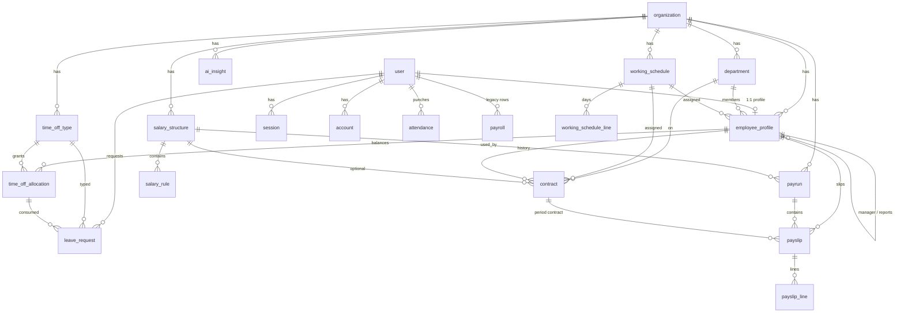

# PeoplePay360 database design

Source of truth: [`prisma/schema.prisma`](../prisma/schema.prisma).  
Engine: **PostgreSQL**. ORM: **Prisma 7**. Connection string: `DATABASE_URL` in `.env` (see `prisma.config.ts`).

Prisma maps each `model` to a physical table via `@@map("...")`. IDs that use `@default(cuid())` are Prisma-generated CUID strings. Better Auth tables (`user`, `session`, `account`, `verification`) use string IDs supplied by the auth library (typically UUIDs).

Backend folder map (after the `fix: folder strcture` pull): [`BACKEND.md`](./BACKEND.md).

---

## 0. Where schema is used in the repo

UI pages under `app/admin/**` and `app/employee/**` call **server actions**. Actions talk to Prisma (`lib/db.ts` → `generated/prisma`). Domain math that is not a table lives in helper folders.

```
app/                    # routes / UI (not the schema)
lib/
  db.ts                 # Prisma client
  auth/                 # Better Auth, session, permissions
  shared/               # types, Zod, mappers, dates, mail
  people/               # leave/attendance/contract/schedule helpers (no SQL)
  payroll/              # salary compute engine + warnings (no SQL)
  ai/                   # metrics, sanitize, copilot
  actions/
    auth.ts             # login / password
    dashboard.ts
    profile.ts
    users.ts
    ai.ts
    people/             # employees, departments, schedules, contracts, attendance, leave, allocations, types
    payroll/            # salary, payruns, payroll-dashboard, legacy payroll
prisma/                 # schema.prisma, migrations/, seed.ts
```

| Domain | Tables | Actions (writes) | Helpers (rules, not FKs) |
| --- | --- | --- | --- |
| Auth | `user`, `session`, `account`, `verification` | `lib/actions/auth.ts`, `lib/actions/users.ts` | `lib/auth/server.ts`, `lib/auth/session.ts`, `lib/auth/permissions.ts` |
| People master | `department`, `working_schedule*`, `employee_profile`, `contract` | `lib/actions/people/{departments,schedules,employees,contracts}.ts` | `lib/people/{employee-id,department-code,contract-period,schedule-hours}.ts` |
| Time | `attendance`, `time_off_type`, `time_off_allocation`, `leave_request` | `lib/actions/people/{attendance,time-off-types,allocations,leave}.ts` | `lib/people/{attendance-metrics,leave-rules,time-off-balance}.ts` |
| Payroll | `salary_structure`, `salary_rule`, `payrun`, `payslip*` | `lib/actions/payroll/{salary,payruns,payroll-dashboard,payroll}.ts` | `lib/payroll/{compute,warnings,worked-days,period-wage}.ts` |
| AI | `ai_insight` | `lib/actions/ai.ts` | `lib/ai/**` |
| Shared | — | — | `lib/shared/{types,validations,mappers,dates,mail}.ts` |

---

## 1. How the data is grouped

| Domain | Tables | Purpose |
| --- | --- | --- |
| Auth (Better Auth) | `user`, `session`, `account`, `verification` | Login, cookies, credential password hash |
| Tenant | `organization` | One company (seeded as Odoo / `ODOO`) |
| People master | `department`, `working_schedule`, `working_schedule_line`, `employee_profile`, `contract` | Employee hub, contracts, schedules |
| Time | `attendance`, `time_off_type`, `time_off_allocation`, `leave_request` | Attendance punches and leave |
| Payroll | `salary_structure`, `salary_rule`, `payrun`, `payslip`, `payslip_line` | Rules → payruns → payslips |
| AI | `ai_insight` | Cached workforce insights |
| Legacy | `payroll` | Old per-user month row; kept until fully retired |

**Central hub:** `employee_profile` is the HR master record. It is **1:1** with `user`. Attendance and leave still hang off `user` (auth identity). Contracts, allocations, and payslips hang off `employee_profile`.

---

## 2. Entity-relationship overview



---

## 3. Enumerations (PostgreSQL enum types)

Prisma creates a Postgres enum for each of these.

### `Role` (also stored as a string on `user.role`)

| Value | Meaning |
| --- | --- |
| `admin` | Full access + user management |
| `hr_manager` | People / attendance / time off; no payroll |
| `hr_payroll_user` | Payroll draft/compute; structures read-only |
| `hr_payroll_manager` | Payroll finalize + salary config CRUD |
| `employee` | Self-service only |

`user.role` is a **plain `TEXT`** (Better Auth), default `'employee'`.  
`employee_profile.role` is the **`Role` enum**. They should stay in sync in application code.

### `EmployeeStatus`

`active` · `inactive` · `on_leave`

### `EmployeeType`

`full_time` · `intern` · `contractor`  
Used to filter payruns and the payroll dashboard.

### `AttendanceStatus`

`present` · `absent` · `half_day` · `leave`

### `LeaveStatus`

`pending` · `approved` · `rejected`

### `ContractStatus`

`running` · `expired`  
Business rule (app, not DB): at most one **running** contract per employee for overlapping dates.

### `CalendarType`

`fixed` · `variable`

### `TimeOffUnit`

`days` · `hours`

### `TimeOffApprover`

`manager` · `officer`

### `AllocationStatus`

`draft` · `approved` · `refused`  
Approved allocations are what create usable leave balance.

### `SalaryCategory`

`basic` · `allowance` · `gross` · `deduction` · `net` · `contribution`

### `RuleComputation`

| Value | Meaning |
| --- | --- |
| `fixed` | Use `amount` |
| `percent_of_wage` | `%` of contract/stub wage |
| `percent_of_basic` | `%` of running BASIC total |
| `percent_of_gross` | `%` of GROSS |
| `percent_of_category` | `%` of an earlier rule via `percentBaseCode` |
| `formula` | Sandboxed expression in `formula` |

### `PayrunStatus` / `PayslipStatus`

`draft` → `computed` → `validated` → `paid`

---

## 4. Tables (every column, key, and foreign key)

Convention in the column tables:

- **PK** = primary key  
- **UQ** = unique  
- **NN** = `NOT NULL`  
- **FK** = foreign key  

Delete behaviour is listed with each FK.

---

### 4.1 `user`

Auth identity. Created by Better Auth when an admin provisions an account (`lib/auth/server.ts`, `lib/actions/users.ts` / `lib/actions/people/employees.ts`). Session helpers: `lib/auth/session.ts`. RBAC: `lib/auth/permissions.ts`.

| Column | Type | Constraints | Default | Notes |
| --- | --- | --- | --- | --- |
| `id` | `TEXT` | PK | — | Set by Better Auth |
| `name` | `TEXT` | NN | — | Display name |
| `email` | `TEXT` | NN, UQ | — | Login username |
| `emailVerified` | `BOOLEAN` | NN | — | Better Auth flag |
| `image` | `TEXT` | | — | Optional avatar URL |
| `createdAt` | `TIMESTAMP` | NN | — | |
| `updatedAt` | `TIMESTAMP` | NN | — | |
| `role` | `TEXT` | NN | `'employee'` | Must match a `Role` value in app code |
| `mustChangePassword` | `BOOLEAN` | NN | `false` | First-login force to `/change-password` |

**Indexes:** unique on `email`.

**Outgoing relations (children):**

| Child table | Child FK | On delete |
| --- | --- | --- |
| `session` | `userId` | `CASCADE` |
| `account` | `userId` | `CASCADE` |
| `employee_profile` | `userId` | `CASCADE` (1:1) |
| `attendance` | `userId` | `CASCADE` |
| `leave_request` | `userId` | `CASCADE` |
| `payroll` | `userId` | `CASCADE` |

---

### 4.2 `session`

Better Auth HTTP-only cookie sessions.

| Column | Type | Constraints | Default | Notes |
| --- | --- | --- | --- | --- |
| `id` | `TEXT` | PK | — | |
| `expiresAt` | `TIMESTAMP` | NN | — | |
| `token` | `TEXT` | NN, UQ | — | Session token |
| `createdAt` | `TIMESTAMP` | NN | — | |
| `updatedAt` | `TIMESTAMP` | NN | — | |
| `ipAddress` | `TEXT` | | — | |
| `userAgent` | `TEXT` | | — | |
| `userId` | `TEXT` | NN, FK → `user.id` | — | **ON DELETE CASCADE** |

**Indexes:** unique `token`; index `userId`.

---

### 4.3 `account`

Linked login providers. Credential (email/password) rows store the **hashed password**.

| Column | Type | Constraints | Default | Notes |
| --- | --- | --- | --- | --- |
| `id` | `TEXT` | PK | — | |
| `accountId` | `TEXT` | NN | — | For credentials, typically the user id |
| `providerId` | `TEXT` | NN | — | e.g. `credential` |
| `issuer` | `TEXT` | NN | `'local:credential'` | Better Auth 1.7 uniqueness; required for local login |
| `userId` | `TEXT` | NN, FK → `user.id` | — | **ON DELETE CASCADE** |
| `accessToken` | `TEXT` | | — | OAuth |
| `refreshToken` | `TEXT` | | — | OAuth |
| `idToken` | `TEXT` | | — | OAuth |
| `accessTokenExpiresAt` | `TIMESTAMP` | | — | |
| `refreshTokenExpiresAt` | `TIMESTAMP` | | — | |
| `scope` | `TEXT` | | — | |
| `password` | `TEXT` | | — | Password hash (credential provider) |
| `createdAt` | `TIMESTAMP` | NN | — | |
| `updatedAt` | `TIMESTAMP` | NN | — | |

**Indexes:** unique `(issuer, accountId)`; index `userId`.

---

### 4.4 `verification`

Better Auth one-time tokens (email verify, reset, etc.). No FK to `user`.

| Column | Type | Constraints | Default | Notes |
| --- | --- | --- | --- | --- |
| `id` | `TEXT` | PK | — | |
| `identifier` | `TEXT` | NN | — | Usually email |
| `value` | `TEXT` | NN | — | Token |
| `expiresAt` | `TIMESTAMP` | NN | — | |
| `createdAt` | `TIMESTAMP` | | — | |
| `updatedAt` | `TIMESTAMP` | | — | |

**Indexes:** `identifier`.

---

### 4.5 `organization`

Tenant. Seed uses name `Odoo`, slug `ODOO`.

| Column | Type | Constraints | Default | Notes |
| --- | --- | --- | --- | --- |
| `id` | `TEXT` | PK | `cuid()` | |
| `name` | `TEXT` | NN | — | |
| `email` | `TEXT` | NN | — | Org contact |
| `slug` | `TEXT` | NN, UQ | — | Used in employee IDs (`ODOO-2026-001`) |
| `createdAt` | `TIMESTAMP` | NN | `now()` | |
| `updatedAt` | `TIMESTAMP` | NN | `@updatedAt` | |

**Children (all `organizationId`, ON DELETE CASCADE unless noted):**  
`employee_profile`, `department`, `working_schedule`, `time_off_type`, `salary_structure`, `payrun`, `ai_insight`.

---

### 4.6 `department`

| Column | Type | Constraints | Default | Notes |
| --- | --- | --- | --- | --- |
| `id` | `TEXT` | PK | `cuid()` | |
| `organizationId` | `TEXT` | NN, FK → `organization.id` | — | **ON DELETE CASCADE** |
| `name` | `TEXT` | NN | — | Display name |
| `code` | `TEXT` | NN | — | Unique per org |
| `createdAt` | `TIMESTAMP` | NN | `now()` | |
| `updatedAt` | `TIMESTAMP` | NN | `@updatedAt` | |

**Indexes:** unique `(organizationId, code)`; index `organizationId`.

**Children:**

| Child | FK | On delete |
| --- | --- | --- |
| `employee_profile` | `departmentId` | Restrict (default Prisma: no cascade) |
| `contract` | `departmentId` | Restrict, optional |

---

### 4.7 `working_schedule`

Weekly pattern assigned to employees and/or contracts. `hoursPerWeek` / `daysPerWeek` are **derived in app code** (`lib/people/schedule-hours.ts`) from lines, then stored for list views. Written by `lib/actions/people/schedules.ts`.

| Column | Type | Constraints | Default | Notes |
| --- | --- | --- | --- | --- |
| `id` | `TEXT` | PK | `cuid()` | |
| `organizationId` | `TEXT` | NN, FK → `organization.id` | — | **ON DELETE CASCADE** |
| `name` | `TEXT` | NN | — | e.g. `40 Hours / Week` |
| `calendarType` | `CalendarType` | NN | `fixed` | |
| `timezone` | `TEXT` | NN | `'Asia/Kolkata'` | |
| `active` | `BOOLEAN` | NN | `true` | |
| `hoursPerWeek` | `DECIMAL(6,2)` | NN | — | Stored derived total |
| `daysPerWeek` | `INTEGER` | NN | — | Stored derived count |
| `createdAt` | `TIMESTAMP` | NN | `now()` | |
| `updatedAt` | `TIMESTAMP` | NN | `@updatedAt` | |

**Indexes:** `organizationId`.

**Children:** `working_schedule_line` (`scheduleId`, **CASCADE**); optional FKs from `employee_profile.scheduleId` and `contract.scheduleId` (restrict).

---

### 4.8 `working_schedule_line`

One weekday row of a schedule.

| Column | Type | Constraints | Default | Notes |
| --- | --- | --- | --- | --- |
| `id` | `TEXT` | PK | `cuid()` | |
| `scheduleId` | `TEXT` | NN, FK → `working_schedule.id` | — | **ON DELETE CASCADE** |
| `weekday` | `INTEGER` | NN | — | `1` = Monday … `7` = Sunday |
| `startMin` | `INTEGER` | NN | — | Minutes from midnight |
| `endMin` | `INTEGER` | NN | — | Minutes from midnight |
| `breakMin` | `INTEGER` | NN | `60` | Break length in minutes |
| `hours` | `DECIMAL(4,2)` | NN | — | Derived: `(endMin - startMin - breakMin) / 60` |

**Indexes:** `scheduleId`.

---

### 4.9 `employee_profile`

HR master record. **Exactly one per user** (`userId` unique).

| Column | Type | Constraints | Default | Notes |
| --- | --- | --- | --- | --- |
| `id` | `TEXT` | PK | `cuid()` | Payslip / contract / allocation parent |
| `userId` | `TEXT` | NN, UQ, FK → `user.id` | — | **ON DELETE CASCADE** |
| `organizationId` | `TEXT` | NN, FK → `organization.id` | — | **ON DELETE CASCADE** |
| `employeeId` | `TEXT` | NN, UQ | — | Human code `ODOO-YYYY-NNN` (`lib/people/employee-id.ts`) |
| `fullName` | `TEXT` | NN | — | |
| `role` | `Role` | NN | — | Enum copy of access role |
| `departmentId` | `TEXT` | NN, FK → `department.id` | — | Required department |
| `managerId` | `TEXT` | FK → `employee_profile.id` | — | Self-relation `EmployeeManager` |
| `scheduleId` | `TEXT` | FK → `working_schedule.id` | — | Default working pattern |
| `employeeType` | `EmployeeType` | NN | `full_time` | Payrun / dashboard filter |
| `workLocation` | `TEXT` | | — | |
| `companyName` | `TEXT` | | — | |
| `bankAccount` | `TEXT` | | — | Missing → payslip warning `A/C missing` |
| `wage` | `DECIMAL(12,2)` | | — | Stub wage until a running contract is used |
| `personalEmail` | `TEXT` | | — | Private info |
| `address` | `TEXT` | | — | |
| `joinDate` | `DATE` | | — | `@db.Date` |
| `jobTitle` | `TEXT` | NN | — | |
| `phone` | `TEXT` | | — | |
| `status` | `EmployeeStatus` | NN | `active` | |
| `paidLeaveBalance` | `INTEGER` | NN | `20` | Legacy simple balance; allocations are the OXP model |
| `createdAt` | `TIMESTAMP` | NN | `now()` | |
| `updatedAt` | `TIMESTAMP` | NN | `@updatedAt` | |

**Indexes:** `organizationId`, `departmentId`, `scheduleId`, `managerId`; unique `userId`, unique `employeeId`.

**Foreign keys:**

| Column | References | On delete |
| --- | --- | --- |
| `userId` | `user.id` | CASCADE |
| `organizationId` | `organization.id` | CASCADE |
| `departmentId` | `department.id` | Restrict |
| `managerId` | `employee_profile.id` | Restrict (nullable) |
| `scheduleId` | `working_schedule.id` | Restrict (nullable) |

**Children:** `contract`, `time_off_allocation`, `payslip` (employee FK **CASCADE**).  
Self-relation: `reports[]` are profiles whose `managerId` points here.

---

### 4.10 `contract`

Employment terms over time. Payroll should use the contract that **covers the pay period** (running preferred). CRUD: `lib/actions/people/contracts.ts`. Overlap of two Running windows: `lib/people/contract-period.ts` (not a unique index).

| Column | Type | Constraints | Default | Notes |
| --- | --- | --- | --- | --- |
| `id` | `TEXT` | PK | `cuid()` | |
| `code` | `TEXT` | NN, UQ | — | e.g. `CON/2026/0042` |
| `employeeId` | `TEXT` | NN, FK → `employee_profile.id` | — | **ON DELETE CASCADE** |
| `departmentId` | `TEXT` | FK → `department.id` | — | Optional |
| `scheduleId` | `TEXT` | FK → `working_schedule.id` | — | Optional override |
| `salaryStructureId` | `TEXT` | FK → `salary_structure.id` | — | Optional |
| `jobTitle` | `TEXT` | NN | — | |
| `wage` | `DECIMAL(12,2)` | NN | — | Monthly wage |
| `startDate` | `DATE` | NN | — | |
| `endDate` | `DATE` | | — | `NULL` = open-ended |
| `status` | `ContractStatus` | NN | — | `running` / `expired` |
| `notes` | `TEXT` | | — | |
| `createdAt` | `TIMESTAMP` | NN | `now()` | |
| `updatedAt` | `TIMESTAMP` | NN | `@updatedAt` | |

**Indexes:** `employeeId`, `departmentId`, `scheduleId`, `salaryStructureId`; unique `code`.

**Children:** `payslip.contractId` (optional, restrict).

---

### 4.11 `time_off_type`

Leave policy (Paid Time Off, Sick, Unpaid, Comp Off, …).

| Column | Type | Constraints | Default | Notes |
| --- | --- | --- | --- | --- |
| `id` | `TEXT` | PK | `cuid()` | |
| `organizationId` | `TEXT` | NN, FK → `organization.id` | — | **ON DELETE CASCADE** |
| `name` | `TEXT` | NN | — | |
| `code` | `TEXT` | NN | — | Unique per org |
| `unit` | `TimeOffUnit` | NN | `days` | |
| `requiresAllocation` | `BOOLEAN` | NN | `true` | If true, request needs an approved allocation |
| `approver` | `TimeOffApprover` | NN | `manager` | |
| `color` | `TEXT` | NN | `'zinc'` | UI token, not a second palette |
| `payrollNote` | `TEXT` | | — | Work-entry hint |
| `createdAt` | `TIMESTAMP` | NN | `now()` | |
| `updatedAt` | `TIMESTAMP` | NN | `@updatedAt` | |

**Indexes:** unique `(organizationId, code)`; index `organizationId`.

**Children:** `time_off_allocation` (**CASCADE**); `leave_request.typeId` (restrict).

---

### 4.12 `time_off_allocation`

Granted balance for one employee + type + year. Remaining is **`allocated - taken`** (do not store remaining as a third source of truth).

| Column | Type | Constraints | Default | Notes |
| --- | --- | --- | --- | --- |
| `id` | `TEXT` | PK | `cuid()` | |
| `employeeId` | `TEXT` | NN, FK → `employee_profile.id` | — | **ON DELETE CASCADE** |
| `typeId` | `TEXT` | NN, FK → `time_off_type.id` | — | **ON DELETE CASCADE** |
| `allocated` | `DECIMAL(8,2)` | NN | — | Grant |
| `taken` | `DECIMAL(8,2)` | NN | `0` | Incremented when a request is approved |
| `validityYear` | `INTEGER` | NN | — | e.g. `2026` |
| `status` | `AllocationStatus` | NN | `draft` | Usable only when `approved` |
| `description` | `TEXT` | | — | |
| `createdAt` | `TIMESTAMP` | NN | `now()` | |
| `updatedAt` | `TIMESTAMP` | NN | `@updatedAt` | |

**Indexes:** `employeeId`, `typeId`.

**Children:** `leave_request.allocationId` (optional, restrict).

---

### 4.13 `leave_request`

Apply / decide: `lib/actions/people/leave.ts`. Overlap: `lib/people/leave-rules.ts`. Types: `lib/actions/people/time-off-types.ts`.

| Column | Type | Constraints | Default | Notes |
| --- | --- | --- | --- | --- |
| `id` | `TEXT` | PK | `cuid()` | |
| `userId` | `TEXT` | NN, FK → `user.id` | — | **ON DELETE CASCADE** (auth user, not profile id) |
| `typeId` | `TEXT` | NN, FK → `time_off_type.id` | — | Restrict |
| `allocationId` | `TEXT` | FK → `time_off_allocation.id` | — | Required in app when type needs allocation |
| `startDate` | `DATE` | NN | — | |
| `endDate` | `DATE` | NN | — | Inclusive |
| `duration` | `DECIMAL(8,2)` | NN | — | Days or hours per type unit |
| `remarks` | `TEXT` | NN | — | Reason |
| `status` | `LeaveStatus` | NN | `pending` | |
| `adminComment` | `TEXT` | | — | Approve/refuse comment |
| `createdAt` | `TIMESTAMP` | NN | `now()` | |
| `updatedAt` | `TIMESTAMP` | NN | `@updatedAt` | |

**Indexes:** `(userId, status)`, `(startDate, endDate)`, `typeId`, `allocationId`.

Overlap is enforced in application code (`lib/people/leave-rules.ts` / `lib/actions/people/leave.ts`), not a DB exclusion constraint.

---

### 4.14 `attendance`

One punch row per user per calendar day (`Asia/Kolkata` via `lib/shared/dates.ts`). Written by `lib/actions/people/attendance.ts`. Worked/overtime hours: `lib/people/attendance-metrics.ts`.

| Column | Type | Constraints | Default | Notes |
| --- | --- | --- | --- | --- |
| `id` | `TEXT` | PK | `cuid()` | |
| `userId` | `TEXT` | NN, FK → `user.id` | — | **ON DELETE CASCADE** |
| `date` | `DATE` | NN | — | Calendar day |
| `checkIn` | `TIMESTAMP` | | — | |
| `checkOut` | `TIMESTAMP` | | — | |
| `status` | `AttendanceStatus` | NN | — | |
| `workedHours` | `DECIMAL(6,2)` | | — | Derived from in/out and schedule |
| `overtimeHours` | `DECIMAL(6,2)` | | — | Above expected hours |
| `notes` | `TEXT` | | — | |
| `manualEdit` | `BOOLEAN` | NN | `false` | True after HR correction |
| `createdAt` | `TIMESTAMP` | NN | `now()` | |
| `updatedAt` | `TIMESTAMP` | NN | `@updatedAt` | |

**Indexes:** unique `(userId, date)` — blocks duplicate check-in for the same day; index `date`.

---

### 4.15 `salary_structure`

Named bag of rules (e.g. Regular Salary). Selected on a payrun. CRUD: `lib/actions/payroll/salary.ts`.

| Column | Type | Constraints | Default | Notes |
| --- | --- | --- | --- | --- |
| `id` | `TEXT` | PK | `cuid()` | |
| `organizationId` | `TEXT` | NN, FK → `organization.id` | — | **ON DELETE CASCADE** |
| `name` | `TEXT` | NN | — | |
| `active` | `BOOLEAN` | NN | `true` | |
| `createdAt` | `TIMESTAMP` | NN | `now()` | |
| `updatedAt` | `TIMESTAMP` | NN | `@updatedAt` | |

**Indexes:** `organizationId`.

**Children:** `salary_rule` (**CASCADE**); `contract.salaryStructureId` (optional); `payrun.structureId` (**restrict** — cannot delete a structure that has payruns).

---

### 4.16 `salary_rule`

Ordered computation line. Sequence is the execution order.

| Column | Type | Constraints | Default | Notes |
| --- | --- | --- | --- | --- |
| `id` | `TEXT` | PK | `cuid()` | Copied onto payslip lines when present |
| `structureId` | `TEXT` | NN, FK → `salary_structure.id` | — | **ON DELETE CASCADE** |
| `name` | `TEXT` | NN | — | e.g. House Rent Allowance |
| `code` | `TEXT` | NN | — | e.g. `HRA`, `BASIC` |
| `category` | `SalaryCategory` | NN | — | |
| `sequence` | `INTEGER` | NN | — | Lower runs first |
| `computation` | `RuleComputation` | NN | — | |
| `amount` | `DECIMAL(12,2)` | | — | For `fixed` |
| `percentage` | `DECIMAL(8,4)` | | — | For percent methods |
| `percentBaseCode` | `TEXT` | | — | Earlier rule code for `percent_of_category` |
| `formula` | `TEXT` | | — | For `formula` |
| `createdAt` | `TIMESTAMP` | NN | `now()` | |
| `updatedAt` | `TIMESTAMP` | NN | `@updatedAt` | |

**Indexes:** `structureId`.  
There is **no FK** from `payslip_line.ruleId` to this table (optional string only), so deleting a rule does not cascade to historical slips.

---

### 4.17 `payrun`

One payroll batch for a period + structure. Created only after the wizard’s **Create Payrun** step. Lifecycle: `lib/actions/payroll/payruns.ts`. Engine: `lib/payroll/compute.ts`.

| Column | Type | Constraints | Default | Notes |
| --- | --- | --- | --- | --- |
| `id` | `TEXT` | PK | `cuid()` | |
| `organizationId` | `TEXT` | NN, FK → `organization.id` | — | **ON DELETE CASCADE** |
| `name` | `TEXT` | NN | — | e.g. `January 2026` |
| `structureId` | `TEXT` | NN, FK → `salary_structure.id` | — | Restrict |
| `periodStart` | `DATE` | NN | — | |
| `periodEnd` | `DATE` | NN | — | |
| `employeeType` | `EmployeeType` | | — | `NULL` = all types |
| `status` | `PayrunStatus` | NN | `draft` | Workflow |
| `createdAt` | `TIMESTAMP` | NN | `now()` | |
| `updatedAt` | `TIMESTAMP` | NN | `@updatedAt` | |

**Indexes:** `organizationId`, `structureId`.

**Children:** `payslip` (**CASCADE** — deleting a payrun deletes its slips and lines).

---

### 4.18 `payslip`

One employee inside a payrun.

| Column | Type | Constraints | Default | Notes |
| --- | --- | --- | --- | --- |
| `id` | `TEXT` | PK | `cuid()` | |
| `payrunId` | `TEXT` | NN, FK → `payrun.id` | — | **ON DELETE CASCADE** |
| `employeeId` | `TEXT` | NN, FK → `employee_profile.id` | — | **ON DELETE CASCADE** (profile id, not `user.id`) |
| `contractId` | `TEXT` | FK → `contract.id` | — | Period contract when Malay’s contracts exist |
| `workedDays` | `DECIMAL(6,2)` | NN | — | |
| `status` | `PayslipStatus` | NN | `draft` | |
| `warning` | `TEXT` | | — | `A/C missing`, `No contract for this period`, `Duplicate` |
| `wage` | `DECIMAL(12,2)` | NN | `0` | Wage used at compute time |
| `gross` | `DECIMAL(12,2)` | NN | `0` | From GROSS rule |
| `net` | `DECIMAL(12,2)` | NN | `0` | From NET rule |
| `sentAt` | `TIMESTAMP` | | — | Set when email send succeeds |
| `createdAt` | `TIMESTAMP` | NN | `now()` | |
| `updatedAt` | `TIMESTAMP` | NN | `@updatedAt` | |

**Indexes:** unique `(payrunId, employeeId)` — one slip per employee per run; `employeeId`; `contractId`.

**Children:** `payslip_line` (**CASCADE**).

---

### 4.19 `payslip_line`

Frozen copy of a salary-rule result. `ruleId` is **not** a foreign key (snapshot). Written when compute rewrites lines in `lib/actions/payroll/payruns.ts`.

| Column | Type | Constraints | Default | Notes |
| --- | --- | --- | --- | --- |
| `id` | `TEXT` | PK | `cuid()` | |
| `payslipId` | `TEXT` | NN, FK → `payslip.id` | — | **ON DELETE CASCADE** |
| `ruleId` | `TEXT` | | — | **Not an FK**; snapshot of `salary_rule.id` if known |
| `name` | `TEXT` | NN | — | |
| `code` | `TEXT` | NN | — | |
| `category` | `SalaryCategory` | NN | — | |
| `amount` | `DECIMAL(12,2)` | NN | — | Positive; UI may show deductions with a minus |

**Indexes:** `payslipId`.

---

### 4.20 `ai_insight`

Cached AI / analytics cards for an organization. Written by `lib/actions/ai.ts`. Metrics/sanitize: `lib/ai/**`.

| Column | Type | Constraints | Default | Notes |
| --- | --- | --- | --- | --- |
| `id` | `TEXT` | PK | `cuid()` | |
| `organizationId` | `TEXT` | NN, FK → `organization.id` | — | **ON DELETE CASCADE** |
| `severity` | `TEXT` | NN | — | App-defined (not an enum) |
| `title` | `TEXT` | NN | — | |
| `body` | `TEXT` | NN | — | |
| `action` | `TEXT` | NN | — | Suggested action copy |
| `href` | `TEXT` | | — | In-app link |
| `payload` | `JSONB` | | — | Extra structured data (`Json?`) |
| `generatedAt` | `TIMESTAMP` | NN | `now()` | |
| `expiresAt` | `TIMESTAMP` | NN | — | Cache expiry |

**Indexes:** `(organizationId, generatedAt)`.

---

### 4.21 `payroll` (legacy)

Old month editor. **Do not use for new payroll.** Kept so existing rows and generated `net_salary` still exist.

| Column | Type | Constraints | Default | Notes |
| --- | --- | --- | --- | --- |
| `id` | `TEXT` | PK | `cuid()` | |
| `userId` | `TEXT` | NN, FK → `user.id` | — | **ON DELETE CASCADE** |
| `month` | `TEXT` | NN | — | `YYYY-MM` |
| `basic` | `DECIMAL(12,2)` | NN | — | |
| `hra_pct` | `DECIMAL(5,2)` | NN | — | Prisma field `hraPct` |
| `allowance_pct` | `DECIMAL(5,2)` | NN | — | Prisma field `allowancePct` |
| `deductions` | `DECIMAL(12,2)` | NN | — | |
| `net_salary` | `DECIMAL(12,2)` | NN | **generated** | See formula below |
| `createdAt` | `TIMESTAMP` | NN | `now()` | |
| `updatedAt` | `TIMESTAMP` | NN | `@updatedAt` | |

**Generated column (Postgres):**

```sql
net_salary = basic + (basic * hra_pct / 100.0) + (basic * allowance_pct / 100.0) - deductions
```

**Indexes:** unique `(userId, month)`.

---

## 5. Foreign-key catalog (all FKs)

| From | Column | To | On delete |
| --- | --- | --- | --- |
| `session` | `userId` | `user.id` | CASCADE |
| `account` | `userId` | `user.id` | CASCADE |
| `employee_profile` | `userId` | `user.id` | CASCADE |
| `employee_profile` | `organizationId` | `organization.id` | CASCADE |
| `employee_profile` | `departmentId` | `department.id` | Restrict |
| `employee_profile` | `managerId` | `employee_profile.id` | Restrict |
| `employee_profile` | `scheduleId` | `working_schedule.id` | Restrict |
| `department` | `organizationId` | `organization.id` | CASCADE |
| `working_schedule` | `organizationId` | `organization.id` | CASCADE |
| `working_schedule_line` | `scheduleId` | `working_schedule.id` | CASCADE |
| `contract` | `employeeId` | `employee_profile.id` | CASCADE |
| `contract` | `departmentId` | `department.id` | Restrict |
| `contract` | `scheduleId` | `working_schedule.id` | Restrict |
| `contract` | `salaryStructureId` | `salary_structure.id` | Restrict |
| `time_off_type` | `organizationId` | `organization.id` | CASCADE |
| `time_off_allocation` | `employeeId` | `employee_profile.id` | CASCADE |
| `time_off_allocation` | `typeId` | `time_off_type.id` | CASCADE |
| `leave_request` | `userId` | `user.id` | CASCADE |
| `leave_request` | `typeId` | `time_off_type.id` | Restrict |
| `leave_request` | `allocationId` | `time_off_allocation.id` | Restrict |
| `attendance` | `userId` | `user.id` | CASCADE |
| `salary_structure` | `organizationId` | `organization.id` | CASCADE |
| `salary_rule` | `structureId` | `salary_structure.id` | CASCADE |
| `payrun` | `organizationId` | `organization.id` | CASCADE |
| `payrun` | `structureId` | `salary_structure.id` | Restrict |
| `payslip` | `payrunId` | `payrun.id` | CASCADE |
| `payslip` | `employeeId` | `employee_profile.id` | CASCADE |
| `payslip` | `contractId` | `contract.id` | Restrict |
| `payslip_line` | `payslipId` | `payslip.id` | CASCADE |
| `ai_insight` | `organizationId` | `organization.id` | CASCADE |
| `payroll` | `userId` | `user.id` | CASCADE |

**Not a foreign key:** `payslip_line.ruleId`, `verification` (no user FK), `user.role` (string, not enum FK).

---

## 6. Unique constraints that encode business rules

| Table | Unique | Rule |
| --- | --- | --- |
| `user` | `email` | One login per email |
| `account` | `(issuer, accountId)` | One credential row per issuer |
| `session` | `token` | One session token |
| `organization` | `slug` | One org slug |
| `department` | `(organizationId, code)` | Department codes unique in the org |
| `employee_profile` | `userId` | One HR profile per login |
| `employee_profile` | `employeeId` | Human employee code unique |
| `contract` | `code` | Contract numbers unique globally |
| `time_off_type` | `(organizationId, code)` | Type codes unique in the org |
| `attendance` | `(userId, date)` | One attendance row per person per day |
| `payslip` | `(payrunId, employeeId)` | One payslip per employee in a run |
| `payroll` | `(userId, month)` | Legacy: one month row per user |

Rules **not** in the database (application only): overlapping running contracts (`lib/people/contract-period.ts`, `lib/actions/people/contracts.ts`); leave date overlap (`lib/people/leave-rules.ts`, `lib/actions/people/leave.ts`); payrun duplicate-across-runs warning (`lib/payroll/warnings.ts`).

---

## 7. Identity split: `user` vs `employee_profile` vs payslip `employeeId`

| ID | Table | Used for |
| --- | --- | --- |
| `user.id` | `user` | Auth, sessions, attendance, leave requests, legacy payroll |
| `employee_profile.id` | `employee_profile` | Contracts, allocations, **payslips** |
| `employee_profile.employeeId` | same row | Display code `ODOO-2026-008` — not a FK |

`payslip.employeeId` is **`employee_profile.id`**, not `user.id` and not `ODOO-2026-…`.

---

## 8. Suggested payroll compute path (how tables connect)

1. `payrun` names a `salary_structure` and a date period.  
2. Each `payslip` points at an `employee_profile` (and optionally a `contract` whose dates cover that period).  
3. Wage comes from `contract.wage`, else stub `employee_profile.wage`.  
4. `salary_rule` rows for that structure run in `sequence` order (`lib/payroll/compute.ts`, invoked from `lib/actions/payroll/payruns.ts`).  
5. Results are stored as `payslip_line` plus `payslip.gross` / `payslip.net`.  
6. Worked days come from attendance / leave / schedule in application code (`lib/payroll/worked-days.ts`), then stored on `payslip.workedDays`.

---

## 9. Migrations

SQL lives under [`prisma/migrations/`](../prisma/migrations/). Apply with:

```bash
npx prisma migrate deploy
```

Regenerate the client with `npx prisma generate`. The client is emitted to `generated/prisma/`.

---

## 10. Seed (what a fresh DB contains)

`npm run db:seed` (`prisma/seed.ts`) typically creates:

- Organization Odoo (`ODOO`)
- Admin `admin@odoo.com`
- Demo employees, departments, and related HR/payroll sample rows (including Regular Salary and sample payruns when payroll seed is present)

Never commit real `DATABASE_URL` / SMTP secrets; only `.env.example` placeholders.
