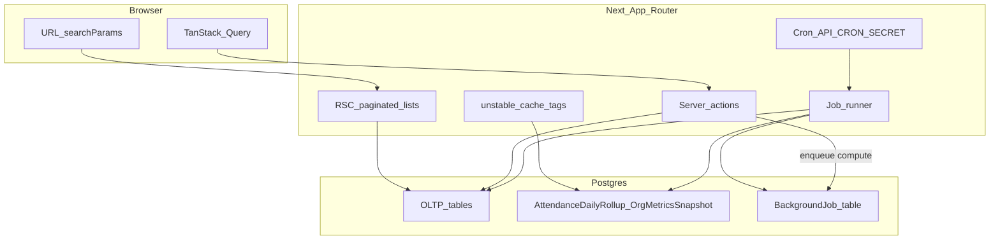

# HRMS Scale-to-5k Plan

**Date:** 2026-09-05  
**Status:** Partially implemented (S0–S5 core landed 2026-09-05; TanStack list hooks still thin — provider only)  
**Audience:** Engineers turning PeoplePay360 / HRMS into production-ready software at ~5,000 employees  
**Product shape (locked):** Single organization — **not** multi-tenant SaaS  

**Related:**

- [2026-09-05-performance-optimization.md](./2026-09-05-performance-optimization.md) — list pagination, indexes, dashboard cache (P0–P2 partially landed)
- [2026-09-05-ai-analytics-implementation.md](./2026-09-05-ai-analytics-implementation.md) — AI metrics / insights / copilot (must move off live org scans)
- Existing cron pattern: `app/api/cron/payslips/route.ts` + `CRON_SECRET`

---

## 1. Goal

Make the HRMS feel and measure as **real software at ~5,000 employees** on the current stack (Next.js App Router, Prisma, PostgreSQL, Better Auth) **without** a rewrite.

### 1.1 Success metrics

| Metric | Target at ~5k employees |
|--------|-------------------------|
| Attendance list (default week window, pageSize 20) p95 | &lt; 200ms |
| Admin home (dashboard + payroll KPIs) p95 | &lt; 150ms from rollups/cache; &lt; 500ms cold rebuild |
| AI analytics / copilot request path | Reads **snapshot/rollups only** — no unbounded attendance/leave `findMany` |
| Payrun compute / bulk email | Enqueued job; HTTP returns in &lt; ~2s; work finishes async |
| List / board server actions | No unbounded `findMany` without `take` (except tiny enums: leave types, structures) |
| Employee search (`q`) | Trigram / indexed path; typeahead APIs `take ≤ 40` |
| RSC HTML for typical list page | Scales with `pageSize`, not headcount |
| Concurrent staff use | Pool + tagged cache survive dozens of parallel admin sessions |

**North star:** ship a **page of rows** and **precomputed metrics**. Never serialize the warehouse on a user click.

### 1.2 Non-goals (this plan)

- Rewriting off Prisma or leaving Postgres
- Microservices / separate “HR API”
- Multi-tenant SaaS (`organizationId` isolation across customers)
- Redis on day one (add later only if stampede or job locks demand it)
- Read replicas until a single primary + rollups is proven insufficient
- Realtime websockets for attendance
- Virtualizing thousands of DOM rows (always page on the server)

---

## 2. Current baseline (after perf P0–P2)

### 2.1 Already improved

| Area | Reality |
|------|---------|
| Employees directory | Server `skip`/`take`, URL filters/sort, tagged stats cache |
| Attendance / contracts / leave / allocations / payslips | Server pagination + URL contract |
| Payruns list | `_count` + warning `groupBy`; no full slip arrays |
| Payslip list | No `lines` include |
| `computePayrun` | Batched duplicate detection (no per-slip `findFirst` loop) |
| Admin + payroll dashboards | `groupBy` / aggregates + `unstable_cache` (~30s) + tags |
| Recruitment | Stage-capped kanban + paginated applicants + aggregate stats |
| Indexes | `20260905220000_employee_list_indexes`, `20260905230000_perf_list_indexes` |
| Client | `QueryProvider` in `AppChrome`; `xlsx` dynamic-imported on import action |

### 2.2 Still not 5k-safe

| Area | Path | Risk at 5k |
|------|------|------------|
| AI snapshot assembly | `lib/actions/ai.ts` | Live org-wide employees + attendance + leave scans |
| Performance board | `lib/actions/performance.ts` | Unbounded reviews / employees |
| Departments | `lib/actions/people/departments.ts` | Nested members grow with headcount |
| Eligible employees / wage rows | `lib/actions/payroll/payruns.ts`, payroll loaders | Full active roster into pickers |
| Notifications | `lib/actions/notifications.ts` | Unbounded or weakly capped feeds |
| Attendance “late” KPI | `listAttendanceLogs` late probe | Up to thousands of `checkIn` rows per window |
| Payrun compute UX | `computePayrunAction` | Still synchronous HTTP for O(n) slips |
| Search | ILIKE `%q%` on names | Degrades without `pg_trgm` |
| TanStack usage | Provider only | Lists still mostly RSC + `router.refresh` |
| Bundle | Dashboard Recharts | Still on critical admin-home client graph |

### 2.3 Scale math (why this plan exists)

| Domain | Approx volume at 5k |
|--------|---------------------|
| Employees | 5,000 profiles |
| Attendance / year | ~5k × ~250 workdays ≈ **1.25M** rows |
| Payslips / year | ~5k × 12 ≈ **60k** |
| Leave / year | Tens of thousands |
| AI “scan everything” on click | **Unacceptable** |

---

## 3. Target architecture

Three pillars, one product:

1. **Metrics / rollups** — dashboards + AI read precomputed numbers  
2. **DB-backed background jobs** — heavy work never blocks the request  
3. **Finish unbounded loaders** — same pagination discipline everywhere else  



### 3.1 Request vs background

| On the request path | In a background job |
|---------------------|---------------------|
| Paginated lists / detail by id | Payrun compute / validate pipeline |
| Read rollups + short `unstable_cache` | AI / org metrics snapshot rebuild |
| Enqueue job + return status | Bulk payslip email, chunked employee import |
| Typeahead `take: 20–40` | Nightly attendance rollup backfill / repair |

---

## 4. Pillar A — Metrics and rollups

### 4.1 Models (names locked)

#### `AttendanceDailyRollup`

One row per organization per calendar day (Kolkata date key stored as `@db.Date`).

| Column | Purpose |
|--------|---------|
| `id` | cuid |
| `organizationId` | FK → Organization |
| `date` | Day bucket |
| `presentCount` | `present` + optionally track half_day separately |
| `halfDayCount` | half_day |
| `absentCount` | absent |
| `leaveCount` | leave |
| `lateCount` | late check-ins (computed at write/rebuild) |
| `missingCheckoutCount` | checked in, no checkout |
| `updatedAt` | last rebuild / bump |

**Constraints:** `@@unique([organizationId, date])`, `@@index([organizationId, date])`.

**Consumers:** admin home attendance health, payroll dashboard today/period KPIs, AI attendance inputs.

#### `OrgMetricsSnapshot`

Latest (and optionally historical) org-level snapshot for dashboards + AI.

| Column | Purpose |
|--------|---------|
| `id` | cuid |
| `organizationId` | FK → Organization |
| `kind` | enum/string: `admin_home` \| `payroll_kpis` \| `ai_analytics` \| `all` |
| `payload` | `Json` — aggregates only (counts, dept distributions, salary-by-dept, flight-risk **summaries**, insight inputs). **No** bank accounts, passwords, full payslip lines |
| `generatedAt` | when builder finished |
| `sourceJobId` | optional FK / string link to `BackgroundJob` |
| `createdAt` / `updatedAt` | audit |

**Constraints:** `@@index([organizationId, kind, generatedAt])`.  
**Read path:** prefer latest row per `(organizationId, kind)` — UI never rebuilds on GET.

Wire on `Organization`:

```text
attendanceDailyRollups AttendanceDailyRollup[]
metricsSnapshots       OrgMetricsSnapshot[]
backgroundJobs         BackgroundJob[]
```

### 4.2 Write / invalidate strategy

| Event | Rollup action | Snapshot action |
|-------|---------------|-----------------|
| Attendance upsert / clock in-out | Upsert **that date’s** `AttendanceDailyRollup` for the user’s org | Soft-invalidate: `revalidateTag("attendance"|"payroll")`; enqueue `ai_snapshot_rebuild` only if analytics stale &gt; TTL or user clicks Refresh |
| Leave approve/refuse | May bump today’s leave counts + period leave days in snapshot rebuild | `revalidateTag("leave")`; enqueue snapshot if needed |
| Employee create/deactivate/dept move | — | Enqueue snapshot; `revalidateTag("employees")` |
| Nightly cron | Repair last N days of rollups from raw attendance | Rebuild `ai_analytics` + `admin_home` snapshots |

**Rule:** Request handlers may **bump one day** of rollups cheaply. They must **not** re-scan a year of attendance to answer a dashboard.

### 4.3 Cache tags (extend existing map)

| Tag | Invalidate when |
|-----|-----------------|
| `employees` | Roster / dept moves / import |
| `attendance` | Attendance writes; rollup bump |
| `leave` | Leave / allocation writes |
| `contracts` | Contract writes |
| `payroll` | Payrun / payslip / wage writes |
| `recruitment` | Jobs / candidates |
| `metrics` | Snapshot row written (optional dedicated tag) |

Keep short TTL `unstable_cache` (15–60s) **in front of** rollup/snapshot reads for stampede control — rollups are source of truth, cache is a cushion.

### 4.4 AI path (mandatory)

1. `/admin/analytics` and copilot context loaders read `OrgMetricsSnapshot` (`kind = ai_analytics`) + bounded detail queries (e.g. top-N flight-risk ids already in payload).  
2. **Forbidden on GET:** `employeeProfile.findMany` without `take`, full attendance window loads, full leave history for the org.  
3. **Refresh analytics** button / cron → enqueue `ai_snapshot_rebuild`.  
4. Models continue to see **aggregates only** (align with AI analytics plan — no bank/PII).

---

## 5. Pillar B — Background jobs

### 5.1 Model `BackgroundJob`

| Column | Type / notes |
|--------|----------------|
| `id` | cuid |
| `organizationId` | FK |
| `type` | see §5.2 |
| `status` | `queued` \| `running` \| `succeeded` \| `failed` \| `cancelled` |
| `payload` | Json (ids, filters, month, chunk offsets) |
| `progressCurrent` | Int? |
| `progressTotal` | Int? |
| `result` | Json? (counts, warnings summary) |
| `error` | String? |
| `attempts` | Int default 0 |
| `lockedAt` | DateTime? (claim) |
| `lockedBy` | String? (runner instance id) |
| `createdByUserId` | String? |
| `createdAt` / `updatedAt` | |
| `finishedAt` | DateTime? |

**Indexes:** `(organizationId, status, createdAt)`, `(status, lockedAt)` for claim queries.  
**Claim rule:** transactional `UPDATE … WHERE status = queued OR (running AND lockedAt &lt; stale) LIMIT 1 RETURNING *` (or Prisma interactive transaction equivalent).

### 5.2 Job types (locked)

| `type` | Work | Trigger |
|--------|------|---------|
| `payrun_compute` | Existing compute pipeline for one `payrunId` | Admin “Compute” |
| `ai_snapshot_rebuild` | Build `OrgMetricsSnapshot` (+ optional insight rows) | Refresh / nightly |
| `payslip_bulk_email` | Month-end or payrun send batch | Cron / admin |
| `employee_import_chunk` | Process spreadsheet chunk | Import action after upload metadata stored |
| `attendance_rollup_backfill` | Recompute rollups for date range | Nightly / repair |

### 5.3 Runner

- Extend cron style of [`app/api/cron/payslips/route.ts`](../../app/api/cron/payslips/route.ts):  
  - `GET|POST /api/cron/jobs` (and keep payslips route)  
  - Auth: `Authorization: Bearer ${CRON_SECRET}` or `?secret=`  
- Runner loop: claim ≤ N jobs, execute, mark succeeded/failed, update progress.  
- Local/dev: same route callable manually; optional `npm run jobs:once` script wrapping the claim logic.  
- **No Redis required** for v1.

### 5.4 UX contract

| Surface | Behavior |
|---------|----------|
| Payrun detail | “Compute” enqueues job; UI polls job status or refreshes via `router.refresh` / TanStack; show progress |
| Analytics | Banner: “Last updated {generatedAt}” + Refresh → job |
| Import | Progress from `progressCurrent/progressTotal` |
| Failures | Persist `error`; allow retry (new job or reset to `queued`) |

**Hard rule:** No admin click may hold an HTTP request for multi-minute CPU. Target return &lt; ~2s after enqueue.

---

## 6. Pillar C — Unbounded query backlog (ordered)

Finish the same contract as employees: URL `page` / filters + `skip`/`take`, or typeahead `take ≤ 40`.

| # | Work item | Primary files | Done when |
|---|-----------|---------------|-----------|
| 1 | Performance board / reviews paginated or stage-capped | `lib/actions/performance.ts`, admin performance client | No full-table hydrate |
| 2 | Departments list without all members; members via `departmentId` + page | `lib/actions/people/departments.ts` | Members endpoint paged |
| 3 | Eligible employees / wage pickers → search API `take: 20–40` | `lib/actions/payroll/payruns.ts` (`listEligibleEmployees`) | Create-payrun does not load full roster |
| 4 | Notifications cursor or `take` + `cursor` | `lib/actions/notifications.ts` | Feed bounded |
| 5 | Ban live AI org scans on request path | `lib/actions/ai.ts` | Reads snapshot only |
| 6 | Late / attendance KPIs from `AttendanceDailyRollup` | attendance + dashboards | Remove large late `checkIn` probes |
| 7 | `pg_trgm` on `fullName` / email / `employeeId` | migration + list `where` | EXPLAIN uses index/bitmap for search |
| 8 | TanStack `useQuery` on employees + attendance + recruitment applicants | clients + existing `QueryProvider` | Filter/page without full document navigation where it helps |
| 9 | `dynamic()` Recharts on dashboard / analytics / recruitment | chart islands | Charts off critical first paint |
| 10 | Document / tune `pg` pool `max` for deploy | `lib/db.ts` | Pool sized for concurrent RSC + actions |

---

## 7. Phased implementation order

| Phase | Name | Outcome |
|-------|------|---------|
| **S0** | Measure | Structured timing logs (or simple duration logs) on hot list actions + admin home; record before numbers |
| **S1** | Kill unbounded lists | Backlog items 1–4 (performance, departments, eligible employees, notifications) |
| **S2** | Jobs foundation | `BackgroundJob` model + cron runner + move `payrun_compute` off sync HTTP |
| **S3** | Rollups | `AttendanceDailyRollup` + wire admin/payroll KPIs; bump on attendance writes; nightly repair job |
| **S4** | AI snapshots | `OrgMetricsSnapshot` + `ai_snapshot_rebuild`; analytics/copilot consumers; forbid live scans |
| **S5** | Search & client polish | `pg_trgm`, TanStack on hot lists, Recharts `dynamic()`, pool tuning |

**Suggested first implementation PR after this doc:** **S1**, then **S2**.

Dependencies:

```text
S0 (measure)
  └─ S1 (unbounded)
       └─ S2 (jobs) ──┬─ S3 (rollups) ── S4 (AI snapshots)
                      └─ payslip_bulk_email / import_chunk
                            └─ S5 (search / TanStack / bundle)
```

---

## 8. Definition of done

### Server

- [ ] No list/board/analytics **GET** path uses unbounded `findMany` without `take` (tiny enums excepted).  
- [ ] `AttendanceDailyRollup` populated for recent days; dashboards prefer rollups over raw attendance arrays.  
- [ ] `OrgMetricsSnapshot` serves AI analytics; Refresh enqueues rebuild.  
- [ ] `payrun_compute` runs only via `BackgroundJob`.  
- [ ] Cron job runner authenticated with `CRON_SECRET`.  
- [ ] New indexes (`pg_trgm` + job claim indexes) applied; hot queries checked with `EXPLAIN`.  

### Client

- [ ] Payrun and analytics show job / snapshot freshness.  
- [ ] Pickers use typeahead, not full roster dumps.  
- [ ] TanStack used on at least employees + attendance + recruitment applicants.  
- [ ] Heavy charts loaded via `dynamic` / route split.  

### Measurement

- [ ] Before/after p95 (or p50 + max) recorded for: attendance week list, admin home, AI analytics cold vs warm, payrun compute enqueue.  
- [ ] Optional: seed or synthetic ~5k profiles in a staging DB for a soak check (not required on day one if EXPLAIN + payload gates are solid).  
- [ ] Numbers appended to this doc’s appendix or the implementing PR description.  

---

## 9. Risks and mitigations

| Risk | Mitigation |
|------|------------|
| Stale rollups / snapshots | Per-day bump on write + nightly backfill; UI shows `generatedAt` |
| Job double-run | Claim with `lockedAt` + unique running constraint per `(type, payload.payrunId)` where needed |
| Snapshot PII leak | Payload schema allowlist; never bank accounts, credentials, full slip lines |
| Cron not scheduled in prod | Document required scheduler hit on `/api/cron/jobs`; fail closed without `CRON_SECRET` |
| Rollup drift vs raw | Repair job reconciles last 14–30 days from `Attendance` |
| Over-caching auth/PII | Never cache sessions or payslip detail; short TTL on org aggregates only |

---

## 10. Out of scope (until proven necessary)

- Redis / BullMQ / Inngest (DB jobs first)  
- Postgres partitioning by attendance year (consider after 2–3 years of data)  
- Separate analytics warehouse  
- Multi-region / read replicas  
- Changing payroll **formula** logic in `lib/payroll/compute.ts` (only **when** it runs)

---

## 11. Code references

| Path | Role in this plan |
|------|-------------------|
| `docs/plans/2026-09-05-performance-optimization.md` | Prior list/cache work |
| `docs/plans/2026-09-05-ai-analytics-implementation.md` | AI feature contract; must consume snapshots |
| `lib/actions/ai.ts` | Remove live org scans; read `OrgMetricsSnapshot` |
| `lib/actions/dashboard.ts` | Prefer rollups / snapshot |
| `lib/actions/payroll/payroll-dashboard.ts` | Prefer rollups / snapshot |
| `lib/actions/payroll/payruns.ts` | Enqueue `payrun_compute`; slim eligible employees |
| `lib/actions/performance.ts` | S1 pagination / caps |
| `lib/actions/people/departments.ts` | S1 members paging |
| `lib/actions/notifications.ts` | S1 cursor/`take` |
| `lib/actions/people/attendance.ts` | Bump daily rollup; drop heavy late probes |
| `lib/db.ts` | Pool tuning (S5) |
| `app/api/cron/payslips/route.ts` | Auth pattern to copy |
| `components/providers/query-provider.tsx` | Mount point for TanStack list queries |
| `prisma/schema.prisma` | Add rollup, snapshot, job models |
| `lib/shared/pagination.ts` | Shared page clamps |

---

## 12. Summary

The codebase is **partially optimized for mid-size demos** (paginated hot lists + cached dashboards). Reaching **~5k as actual software** requires three structural moves: **precomputed metrics**, **async jobs for heavy work**, and **zero unbounded loaders** on remaining boards — all while staying on a **single-org** Next + Postgres monolith.

Implement in order **S1 → S2 → S3 → S4 → S5**, measuring as you go. Do not claim “5k scalable” until AI and payrun are off the synchronous request path and dashboards read rollups/snapshots.

---

## Appendix A — Draft Prisma sketches (implementation reference)

Illustrative only; adjust types to match existing enums/conventions when implementing.

```prisma
enum BackgroundJobStatus {
  queued
  running
  succeeded
  failed
  cancelled
}

enum BackgroundJobType {
  payrun_compute
  ai_snapshot_rebuild
  payslip_bulk_email
  employee_import_chunk
  attendance_rollup_backfill
}

enum OrgMetricsKind {
  admin_home
  payroll_kpis
  ai_analytics
  all
}

model AttendanceDailyRollup {
  id                   String       @id @default(cuid())
  organizationId       String
  organization         Organization @relation(fields: [organizationId], references: [id], onDelete: Cascade)
  date                 DateTime     @db.Date
  presentCount         Int          @default(0)
  halfDayCount         Int          @default(0)
  absentCount          Int          @default(0)
  leaveCount           Int          @default(0)
  lateCount            Int          @default(0)
  missingCheckoutCount Int          @default(0)
  updatedAt            DateTime     @updatedAt

  @@unique([organizationId, date])
  @@index([organizationId, date])
  @@map("attendance_daily_rollup")
}

model OrgMetricsSnapshot {
  id             String         @id @default(cuid())
  organizationId String
  organization   Organization   @relation(fields: [organizationId], references: [id], onDelete: Cascade)
  kind           OrgMetricsKind
  payload        Json
  generatedAt    DateTime
  sourceJobId    String?
  createdAt      DateTime       @default(now())
  updatedAt      DateTime       @updatedAt

  @@index([organizationId, kind, generatedAt])
  @@map("org_metrics_snapshot")
}

model BackgroundJob {
  id               String              @id @default(cuid())
  organizationId   String
  organization     Organization        @relation(fields: [organizationId], references: [id], onDelete: Cascade)
  type             BackgroundJobType
  status           BackgroundJobStatus @default(queued)
  payload          Json
  progressCurrent  Int?
  progressTotal    Int?
  result           Json?
  error            String?
  attempts         Int                 @default(0)
  lockedAt         DateTime?
  lockedBy         String?
  createdByUserId  String?
  createdAt        DateTime            @default(now())
  updatedAt        DateTime            @updatedAt
  finishedAt       DateTime?

  @@index([organizationId, status, createdAt])
  @@index([status, lockedAt])
  @@map("background_job")
}
```

## Appendix B — Measurement log (fill during implementation)

| Surface | Before | After | Notes |
|---------|--------|-------|-------|
| Attendance week list | | | |
| Admin home | | | |
| AI analytics warm | | | |
| Payrun compute (enqueue) | | | |
