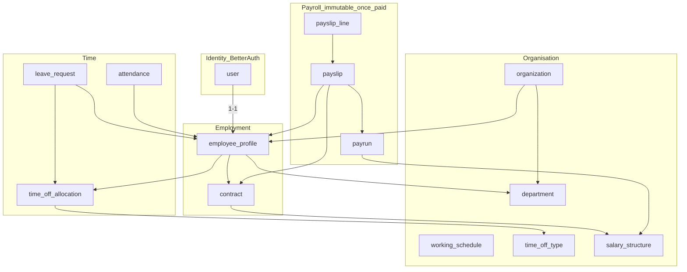

# Production Database Robustness Implementation Plan

> **For Claude:** REQUIRED SUB-SKILL: Use superpowers:executing-plans to implement this plan task-by-task.

**Goal:** Make the PeoplePay360 PostgreSQL schema enforce ACID invariants in the database (not only in TypeScript), reach **BCNF** on operational tables, and stay fast at **one organisation / ~5,000 employees** on a single primary.

**Architecture:** Keep Prisma 7 + `@prisma/adapter-pg` + one Postgres. Do **not** rewrite the domain or chase 6NF. Collapse dual sources of truth, add CHECK / UNIQUE / EXCLUDE constraints, put `organizationId` on hot fact tables, lock rows inside transactions for leave and payroll, and keep rollups as the only intentional denormalization. Better Auth tables (`user`, `session`, `account`, `verification`) stay as-is except where we stop dual-writing `role` / `name`.

**Tech Stack:** PostgreSQL 16+, Prisma 7 migrations, `pg` pool, existing `tsx --test` + a small SQL invariant suite that needs `DATABASE_URL`.

**Locked product shape:** Single organisation — not multi-tenant SaaS. Aligns with `docs/plans/2026-09-05-scale-5k.md`.

**Related:** `docs/plans/2026-09-05-scale-5k.md` (rollups, jobs, pagination), `docs/plans/2026-09-05-fault-tolerance.md` Task 5 (pool / statement timeout) and Task 8 (payslip `sendingAt`).

---

## Honest limits (read before changing schema)

PostgreSQL already gives **ACID** for statements that run inside a transaction with durable commit. This app is **not** ACID today because:

1. Many writes are auto-commit single statements with **no row lock**, so two approvers can overdraw leave.
2. Invariants live in TypeScript (`remaining()`, date math, unique-by-convention) and **lost races still persist**.
3. Dual columns (`wage` on profile **and** contract, `paidLeaveBalance` **and** `time_off_allocation.taken`, `user.role` **and** `employee_profile.role`) can disagree after a crash mid-write.

**“Highest normalization form” is the wrong production target.** 5NF/6NF would split payslip lines, addresses, and names into dozens of tables. Payroll and attendance would join themselves to death at 5k × 250 attendance rows/year (~1.25M). Production HRIS practice:

| Layer | Form | Why |
| --- | --- | --- |
| OLTP identity / org / people / leave / attendance / contracts | **BCNF** | One fact, one place; FKs + unique keys |
| Payslip header totals + line copies of rule names | **Deliberate snapshot (not live 3NF)** | Legal freeze of a paid period |
| `attendance_daily_rollup`, `org_metrics_snapshot` | **Rebuildable aggregates** | Dashboard/AI must not scan 1.25M rows |
| JSON (`pendingAction`, job `payload`) | Allowed for **ephemeral** workflow only | Not for wages or leave balances |

Out of scope (do not build in this plan): Redis, read replicas, Citus, UUID v7 rewrite of Better Auth ids, monthly `attendance` partitioning (btree is enough at 1.25M; revisit at ~10M), dropping `organizationId` “because we are single-org”.

---

## Current defects (schema review, 2026-09-06)

Source of truth: `prisma/schema.prisma`. **Zero** `CHECK`, `EXCLUDE`, `RLS`, or `isolationLevel` / `FOR UPDATE` in the repo.

### Dual sources of truth (not BCNF)

| Fact | Where it is stored twice | Failure mode |
| --- | --- | --- |
| Display name | `user.name`, `employee_profile.fullName` | Directory ≠ auth header |
| Role | `user.role` (`String`), `employee_profile.role` (`Role`) | Session vs profile diverge (`lib/auth/session.ts` already merges both) |
| Wage | `employee_profile.wage`, `contract.wage` | Payroll picks `contracts[0] ?? profile.wage` |
| Paid leave remaining | `employee_profile.paidLeaveBalance`, `time_off_allocation.taken` | `decideLeaveAction` can decrement **either** path |
| Job department | `job_opening.department` (string), `department.name` | Rename department does not update jobs |
| Candidate role | `candidate.position` plus job title | Drift when job title changes |
| Inactive headcount | `organization.inactiveEmployeeCount` vs count query | Counter can desync |

### Missing uniqueness / overlap protection

- `department`: unique `(organizationId, code)` but **not** `(organizationId, name)`
- `working_schedule_line`: no unique `(scheduleId, weekday)` — two Monday lines possible
- `salary_rule`: no unique `(structureId, code)`
- `time_off_allocation`: no unique `(employeeId, typeId, validityYear)`
- `payrun`: no unique period `(organizationId, periodStart, periodEnd, employeeType)`
- `employee_profile.employeeId` is **globally** unique instead of `(organizationId, employeeId)`
- `leave_request`: no exclusion on overlapping **approved** ranges
- No `CHECK (endDate >= startDate)`, `CHECK (hours > 0)`, `CHECK (checkOut IS NULL OR checkIn IS NOT NULL)`

### Tenant / query shape

`attendance`, `leave_request`, `notification` hang off `userId` with **no** `organizationId`. Copilot SQL joins `employee_profile` every time. At 5k this is a nested-loop tax and a leak risk if a query forgets the join.

### ACID gaps in application code

- `lib/actions/people/leave.ts` `decideLeaveAction`: transaction **without** `FOR UPDATE` on allocation / leave row → lost update on `taken`
- `lib/jobs/handlers/payrun-compute.ts`: per-slip `$transaction([...])` then a **separate** `payrun.update({ status: computed })` — crash between slips leaves a half-computed run; two workers can compute the same run
- No `isolationLevel`
- Legacy `payroll` table still in schema (“until Krishil retires in payrun Phase 3”)

### What is already production-grade (do not undo)

- Attendance `@@unique([userId, date])`
- Payslip `@@unique([payrunId, employeeId])`
- Review `@@unique([cycleId, employeeId])`
- Org-scoped unique codes on departments, time-off types, jobs, candidates
- `attendance_daily_rollup` unique `(organizationId, date)`
- `pg_trgm` GIN on `fullName` / `employeeId`
- Decimal money types (not float)
- Date columns as `@db.Date`
- Generated `payroll.net_salary` on the **legacy** table only

---

## Target logical model (BCNF)



**Source of truth after this plan**

- **Name:** `employee_profile.fullName`; `user.name` kept in sync by the same transaction (Better Auth requires `user.name`).
- **Role:** `user.role` only, typed as Prisma `Role`. Drop `employee_profile.role`.
- **Wage:** running `contract.wage` only. Drop `employee_profile.wage`.
- **Leave remaining:** `allocated - taken` on the approved allocation. Drop `employee_profile.paidLeaveBalance`. `taken` updated only under `FOR UPDATE`.
- **Job department:** `job_opening.departmentId` FK.
- **Attendance / leave:** `employeeId` (profile id) **and** `organizationId`, with composite FK to `employee_profile(id)` and `organization(id)`.

---

### Task 1: Constraint harness and invariant catalog

**Files:**
- Create: `docs/db/invariants.md`
- Create: `lib/db/invariants.test.ts`
- Modify: `package.json` (`test` script — append the new file)

**Step 1: Write the catalog**

Document each invariant as: name, SQL, current status (`missing` / `app-only` / `enforced`). Include at least:

- `leave_dates_ordered`: `endDate >= startDate`
- `attendance_checkout_needs_checkin`
- `schedule_line_one_per_weekday`
- `allocation_unique_per_year`
- `no_overlapping_approved_leave`
- `wage_only_on_contract`
- `leave_balance_only_on_allocation`

**Step 2: Write failing tests for “database would accept garbage”**

These tests are **pure functions** over constraint SQL strings plus a skipped integration `it` if `DATABASE_URL` is unset. Do not require CI to have Postgres for the string tests.

```ts
import assert from "node:assert/strict";
import { describe, it } from "node:test";
import { INVARIANT_SQL } from "./invariants";

describe("db invariants catalog", () => {
  it("includes a leave date order check", () => {
    assert.match(INVARIANT_SQL.leaveDatesOrdered, /endDate["\s]*>=["\s]*startDate/i);
  });

  it("includes btree_gist overlapping leave exclusion", () => {
    assert.match(INVARIANT_SQL.noOverlappingApprovedLeave, /EXCLUDE USING gist/i);
  });
});
```

**Step 3: Create `lib/db/invariants.ts` exporting `INVARIANT_SQL` constants** (the exact SQL that later migrations will apply). Tests fail until the strings exist.

**Step 4: Run**

```bash
npx tsx --test lib/db/invariants.test.ts
```

Expected: FAIL (`Cannot find module` / missing export) then PASS after Step 3.

**Step 5: Commit**

```bash
git add docs/db/invariants.md lib/db/invariants.ts lib/db/invariants.test.ts package.json
git commit -m "docs: catalog database invariants before constraint migrations"
```

---

### Task 2: CHECK constraints (dates, hours, money, weekdays)

**Files:**
- Create: `prisma/migrations/20260906010000_check_constraints/migration.sql`
- Modify: `lib/db/invariants.ts` (status comments)
- Modify: `prisma/schema.prisma` (document CHECKs in `///` comments on the models; Prisma cannot express CHECK)

**Step 1: Write the migration** (apply via `INVARIANT_SQL` copied verbatim):

```sql
ALTER TABLE "leave_request"
  ADD CONSTRAINT "leave_request_dates_ordered"
  CHECK ("endDate" >= "startDate");

ALTER TABLE "leave_request"
  ADD CONSTRAINT "leave_request_duration_nonneg"
  CHECK ("duration" >= 0);

ALTER TABLE "contract"
  ADD CONSTRAINT "contract_dates_ordered"
  CHECK ("endDate" IS NULL OR "endDate" >= "startDate");

ALTER TABLE "contract"
  ADD CONSTRAINT "contract_wage_nonneg"
  CHECK ("wage" >= 0);

ALTER TABLE "attendance"
  ADD CONSTRAINT "attendance_checkout_needs_checkin"
  CHECK ("checkOut" IS NULL OR "checkIn" IS NOT NULL);

ALTER TABLE "working_schedule_line"
  ADD CONSTRAINT "working_schedule_line_weekday"
  CHECK ("weekday" >= 1 AND "weekday" <= 7);

ALTER TABLE "working_schedule_line"
  ADD CONSTRAINT "working_schedule_line_range"
  CHECK ("endMin" > "startMin" AND "startMin" >= 0 AND "endMin" <= 24 * 60);

ALTER TABLE "working_schedule"
  ADD CONSTRAINT "working_schedule_hours_positive"
  CHECK ("hoursPerWeek" > 0 AND "daysPerWeek" BETWEEN 1 AND 7);

ALTER TABLE "time_off_allocation"
  ADD CONSTRAINT "time_off_allocation_amounts"
  CHECK ("allocated" >= 0 AND "taken" >= 0 AND "taken" <= "allocated" + 0.01);

ALTER TABLE "payslip"
  ADD CONSTRAINT "payslip_amounts_nonneg"
  CHECK ("wage" >= 0 AND "gross" >= 0);

ALTER TABLE "performance_goal"
  ADD CONSTRAINT "performance_goal_progress"
  CHECK ("progress" >= 0 AND "progress" <= 100);
```

**Step 2: Repair demo data that would violate CHECKs** before migrate (`prisma/repair-demo-data.ts` or a one-off `UPDATE` in the same migration `USING` clause). If migrate fails, fix data in this migration **above** the `ADD CONSTRAINT` lines:

```sql
UPDATE "leave_request" SET "endDate" = "startDate" WHERE "endDate" < "startDate";
UPDATE "attendance" SET "checkOut" = NULL WHERE "checkIn" IS NULL AND "checkOut" IS NOT NULL;
```

**Step 3: Run migrate on a copy of the DB**

```bash
npx prisma migrate deploy
```

Expected: success. Re-run seed/repair if needed: `npm run db:repair`

**Step 4: Commit**

```bash
git commit -m "fix: enforce date, hour, and money CHECKs in Postgres"
```

---

### Task 3: Unique keys that BCNF requires

**Files:**
- Create: `prisma/migrations/20260906020000_bcnf_unique_keys/migration.sql`
- Modify: `prisma/schema.prisma`

**Step 1: Deduplicate in the migration, then add uniques**

```sql
-- Department names unique per org (case-insensitive)
CREATE UNIQUE INDEX "department_organizationId_lower_name_key"
  ON "department" ("organizationId", lower("name"));

CREATE UNIQUE INDEX "working_schedule_line_scheduleId_weekday_key"
  ON "working_schedule_line" ("scheduleId", "weekday");

CREATE UNIQUE INDEX "salary_rule_structureId_code_key"
  ON "salary_rule" ("structureId", "code");

CREATE UNIQUE INDEX "time_off_allocation_employee_type_year_key"
  ON "time_off_allocation" ("employeeId", "typeId", "validityYear");

CREATE UNIQUE INDEX "payrun_org_period_type_key"
  ON "payrun" ("organizationId", "periodStart", "periodEnd", COALESCE("employeeType"::text, ''));

CREATE UNIQUE INDEX "salary_structure_organizationId_name_key"
  ON "salary_structure" ("organizationId", lower("name"));
```

Prisma cannot express `lower(name)` or `COALESCE` unique indexes. Keep them **SQL-only** and add the simple uniques Prisma can own:

```prisma
model WorkingScheduleLine {
  // ...
  @@unique([scheduleId, weekday])
}

model SalaryRule {
  // ...
  @@unique([structureId, code])
}

model TimeOffAllocation {
  // ...
  @@unique([employeeId, typeId, validityYear])
}
```

**Step 2: Change `EmployeeProfile.employeeId` from global unique to org-scoped**

```prisma
model EmployeeProfile {
  employeeId String
  @@unique([organizationId, employeeId])
}
```

Migration: drop `"employee_profile_employeeId_key"`, create `"employee_profile_organizationId_employeeId_key"`. Keep the trigram GIN.

**Step 3: Add tests in `lib/people/schedule-hours.test.ts` (or a new file) that document weekday uniqueness as a domain rule.** Schema tests are SQL.

**Step 4: `npx prisma migrate deploy` then `npx prisma generate`**

**Step 5: Commit**

```bash
git commit -m "fix: add BCNF unique keys for schedules, rules, allocations, and employee IDs"
```

---

### Task 4: `organizationId` + `employeeId` on attendance and leave

**Files:**
- Create: `prisma/migrations/20260906030000_fact_table_org_employee/migration.sql`
- Modify: `prisma/schema.prisma` (`Attendance`, `LeaveRequest`)
- Modify: every query that loads attendance/leave by `userId` only — start with `lib/actions/people/leave.ts`, `lib/actions/people/attendance.ts`, `lib/ai/copilot-query.ts`, `lib/ai/assistant-execute.ts`

**Step 1: Backfill columns**

```sql
ALTER TABLE "attendance" ADD COLUMN "organizationId" TEXT;
ALTER TABLE "attendance" ADD COLUMN "employeeId" TEXT;

UPDATE "attendance" a
SET "organizationId" = p."organizationId",
    "employeeId" = p.id
FROM "employee_profile" p
WHERE p."userId" = a."userId";

ALTER TABLE "attendance" ALTER COLUMN "organizationId" SET NOT NULL;
ALTER TABLE "attendance" ALTER COLUMN "employeeId" SET NOT NULL;

ALTER TABLE "attendance"
  ADD CONSTRAINT "attendance_employeeId_fkey"
  FOREIGN KEY ("employeeId") REFERENCES "employee_profile"("id") ON DELETE CASCADE;
ALTER TABLE "attendance"
  ADD CONSTRAINT "attendance_organizationId_fkey"
  FOREIGN KEY ("organizationId") REFERENCES "organization"("id") ON DELETE CASCADE;

CREATE INDEX "attendance_organizationId_date_idx" ON "attendance" ("organizationId", "date");
CREATE INDEX "attendance_employeeId_date_idx" ON "attendance" ("employeeId", "date");
```

Repeat for `leave_request`. Keep `userId` for now (Better Auth / existing includes) until Task 6 callers are switched; then drop `userId` **only if** every include is migrated. Safer: keep `userId` as a redundant FK for one release, add a CHECK that it matches the profile:

```sql
-- Same-person integrity (composite, via trigger is simpler than FK across tables)
CREATE OR REPLACE FUNCTION attendance_matches_profile() RETURNS trigger AS $$
BEGIN
  IF NOT EXISTS (
    SELECT 1 FROM employee_profile p
    WHERE p.id = NEW."employeeId"
      AND p."userId" = NEW."userId"
      AND p."organizationId" = NEW."organizationId"
  ) THEN
    RAISE EXCEPTION 'attendance person/org mismatch';
  END IF;
  RETURN NEW;
END;
$$ LANGUAGE plpgsql;
```

**Step 2: Rewrite copilot SQL** in `lib/ai/copilot-query.ts` to filter `a."organizationId" = $org` / `lr."organizationId" = $org` instead of joining through `"user"`.

**Step 3: Write a unit test** that the SQL strings contain `"organizationId"` (string assert on exported query builders) **or** extend `lib/ai/copilot.test.ts` only if you extract SQL fragments. Prefer a small `lib/ai/copilot-query.test.ts` that greps exported SQL if you factor `Prisma.sql` helpers.

**Step 4: Commit**

```bash
git commit -m "fix: stamp organization and employee on attendance and leave rows"
```

---

### Task 5: Exclusion constraint — no overlapping approved leave

**Files:**
- Create: `prisma/migrations/20260906040000_leave_exclusion/migration.sql`
- Modify: `lib/actions/people/leave.ts` (surface the Postgres error as “those dates overlap an approved leave”)
- Modify: `lib/shared/errors.ts` (map SQLSTATE `23P01` exclusion_violation)
- Test: `lib/shared/errors.test.ts`

**Step 1: Failing test for error mapping**

```ts
it("maps exclusion violations to a leave overlap message", () => {
  const err = Object.assign(new Error("conflicting key value violates exclusion constraint"), {
    code: "P2010",
    meta: { code: "23P01" },
  });
  assert.match(publicActionError(err, "Could not save."), /overlap/i);
});
```

**Step 2: Migration**

```sql
CREATE EXTENSION IF NOT EXISTS btree_gist;

ALTER TABLE "leave_request"
  ADD CONSTRAINT "leave_request_no_approved_overlap"
  EXCLUDE USING gist (
    "employeeId" WITH =,
    daterange("startDate", "endDate", '[]') WITH &&
  )
  WHERE (status = 'approved');
```

If `employeeId` is not on `leave_request` yet, this task **must** run after Task 4.

**Step 3: Repair overlaps** in the migration with a preview `SELECT` comment and delete/reject the newer duplicate, or fail migrate loudly so demo data is fixed first.

**Step 4: Commit**

```bash
git commit -m "fix: reject overlapping approved leave in Postgres"
```

---

### Task 6: One leave balance (drop `paidLeaveBalance`)

**Files:**
- Modify: `prisma/schema.prisma` (`EmployeeProfile` remove `paidLeaveBalance`)
- Create: `prisma/migrations/20260906050000_drop_paid_leave_balance/migration.sql`
- Modify: `lib/actions/people/leave.ts` (always lock allocation; never decrement profile)
- Modify: `lib/actions/dashboard.ts`, `lib/auth/session.ts`, `lib/ai/build-snapshot.ts`, `lib/actions/ai.ts`, `prisma/seed.ts`, `prisma/repair-demo-data.ts`
- Test: `lib/people/time-off-balance.test.ts` (already the remaining/taken math — add “profile balance is not a source of truth” comment only)

**Step 1: Remaining paid leave helper**

```ts
// lib/people/time-off-balance.ts
export function remainingFromAllocation(allocated: number, taken: number) {
  return remaining(allocated, taken);
}
```

Dashboard / copilot: `SUM(allocated - taken)` for approved paid allocations in the current year — one SQL aggregate, not a column.

**Step 2: `decideLeaveAction` must lock**

```ts
await prisma.$transaction(async (tx) => {
  const locked = await tx.leaveRequest.findUnique({
    where: { id: leave.id },
  });
  await tx.$executeRaw`SELECT id FROM time_off_allocation WHERE id = ${leave.allocationId} FOR UPDATE`;
  // then taken += days, status update
}, { isolationLevel: "RepeatableRead" });
```

Prisma 7 equivalent if supported:

```ts
await tx.timeOffAllocation.findUnique({
  where: { id: leave.allocationId },
  lock: { mode: "update" },
});
```

**Step 3: Drop column** after all readers compile.

**Step 4: Run** `npx tsx --test lib/people/time-off-balance.test.ts lib/ai/copilot.test.ts`

**Step 5: Commit**

```bash
git commit -m "fix: store paid leave remaining only on allocations"
```

---

### Task 7: Wage lives on the running contract only

**Files:**
- Modify: `prisma/schema.prisma` (remove `EmployeeProfile.wage`)
- Create: `prisma/migrations/20260906060000_drop_profile_wage/migration.sql`
- Modify: `lib/actions/payroll/payroll-dashboard.ts`, `lib/jobs/handlers/payrun-compute.ts`, `prisma/seed.ts`, `lib/actions/people/employees.ts`, `lib/actions/people/contracts.ts`

**Rule:** payroll reads `contract.wage` where `status = running`. Creating an employee **must** create a running contract in the **same** transaction (already true in `createEmployeeAction` — verify and keep).

**Step 1:** Backfill any profile with wage and no running contract:

```sql
-- In migration, only if needed: do not invent contracts silently in prod.
-- Fail migrate if rows exist: profile.wage IS NOT NULL AND no running contract.
```

**Step 2:** Remove `?? profile.wage` fallbacks.

**Step 3:** Commit

```bash
git commit -m "fix: make running contract the only wage source"
```

---

### Task 8: Role and name — one writer

**Files:**
- Modify: `prisma/schema.prisma` (`User.role` type `Role` not `String`; drop `EmployeeProfile.role`)
- Create: `prisma/migrations/20260906070000_role_on_user_only/migration.sql`
- Modify: `lib/auth/session.ts`, `lib/actions/people/employees.ts`, seed/repair

**Step 1:** Data fix: if `user.role` ≠ `employee_profile.role`, prefer `user.role` (authz already uses it).

```sql
-- After verifying no invalid strings:
ALTER TABLE "user" ALTER COLUMN "role" TYPE "Role" USING "role"::"Role";
ALTER TABLE "employee_profile" DROP COLUMN "role";
```

**Step 2:** Name: in the same transaction as profile `fullName` updates, set `user.name`. Add a trigger so a missed caller cannot drift:

```sql
CREATE OR REPLACE FUNCTION sync_user_name_from_profile() RETURNS trigger AS $$
BEGIN
  UPDATE "user" SET name = NEW."fullName" WHERE id = NEW."userId";
  RETURN NEW;
END;
$$ LANGUAGE plpgsql;

CREATE TRIGGER employee_profile_sync_user_name
AFTER INSERT OR UPDATE OF "fullName" ON employee_profile
FOR EACH ROW EXECUTE FUNCTION sync_user_name_from_profile();
```

**Step 3:** Session builder reads `user.role` only.

**Step 4:** Commit

```bash
git commit -m "fix: store role on user only and keep user.name synced from profile"
```

---

### Task 9: Recruitment FKs and candidate stage history

**Files:**
- Modify: `prisma/schema.prisma` (`JobOpening.departmentId`, new `CandidateStageEvent`)
- Create: `prisma/migrations/20260906080000_recruitment_fk_history/migration.sql`
- Modify: `lib/actions` recruitment modules, seed

**Step 1:** Map `job_opening.department` string → `departmentId` by `lower(name)`; fail rows that do not match (or set NULL and keep a `departmentName` snapshot column **only** on closed jobs if you must freeze history — prefer FK + snapshot `departmentNameAtOpen` on the opening).

**Step 2:** `CandidateStageEvent`: `id`, `candidateId`, `fromStage`, `toStage`, `at`, `actorUserId`. Unique not required. Index `(candidateId, at)`.

**Step 3:** Writes to `candidate.stage` insert an event in the same transaction.

**Step 4:** Commit

```bash
git commit -m "fix: link jobs to departments and record candidate stage history"
```

---

### Task 10: Payrun compute is one ACID unit per run (or per locked slip)

**Files:**
- Modify: `lib/jobs/handlers/payrun-compute.ts`
- Modify: `lib/actions/payroll/payruns.ts`
- Test: `lib/payroll/compute.test.ts` stays numeric; add a comment-only lock contract in `docs/db/invariants.md`

**Step 1:** Claim the payrun

```ts
const claimed = await prisma.$transaction(async (tx) => {
  const rows = await tx.$queryRaw<Array<{ id: string; status: string }>>`
    SELECT id, status::text AS status FROM payrun
    WHERE id = ${payrunId} AND status = 'draft'
    FOR UPDATE SKIP LOCKED
  `;
  const row = rows[0];
  if (!row) return null;
  await tx.payrun.update({ where: { id: row.id }, data: { status: "computed" } }); // or a new 'computing' enum
  return row;
});
```

Prefer a new `PayrunStatus.computing` so a crash can be retried (reset `computing` → `draft` after timeout). If you add the enum, migration belongs here.

**Step 2:** Each slip update stays in a transaction **with** `payslip` `FOR UPDATE`. The final status `computed` is set **after** all slips, or use savepoints. Do not leave `status: computed` if slips remain `draft`.

**Step 3:** Unique period from Task 3 prevents two March full-time runs.

**Step 4:** Commit

```bash
git commit -m "fix: lock payruns during compute so two workers cannot double-write"
```

---

### Task 11: Pool, statement timeout, lock timeout (ACID durability under load)

**Files:**
- Modify: `lib/db.ts`
- Create: `prisma/migrations/20260906090000_role_timeouts/migration.sql` **or** set in the connection string / `PrismaPg` config
- Cross-link: finish fault-tolerance Task 5 rather than duplicating a second pool

**Step 1:**

```ts
const adapter = new PrismaPg({
  connectionString,
  connectionTimeoutMillis: 5_000,
  idleTimeoutMillis: 30_000,
  max: Number(process.env.PG_POOL_MAX || (process.env.NODE_ENV === "production" ? 20 : 10)),
  statement_timeout: 15_000,
});
```

If the adapter does not support `statement_timeout`, run after connect:

```sql
ALTER ROLE CURRENT_USER SET statement_timeout = '15s';
ALTER ROLE CURRENT_USER SET lock_timeout = '5s';
ALTER ROLE CURRENT_USER SET idle_in_transaction_session_timeout = '20s';
```

Use a dedicated DB role in production; do not bake this into `postgres` superuser.

**Step 2:** Commit with fault-tolerance Task 5 if that branch is still open; otherwise:

```bash
git commit -m "fix: cap Postgres statement and lock wait times on the app pool"
```

---

### Task 12: Retire legacy `payroll` table

**Files:**
- Grep `prisma.payroll` / `model Payroll`
- Modify: `prisma/schema.prisma` (remove model)
- Create: `prisma/migrations/20260906100000_drop_legacy_payroll/migration.sql`
- Modify: seed/repair if they still insert `payroll`

**Step 1:** Confirm payrun/payslip is the only UI path (`lib/actions/payroll`). If any screen still reads `payroll`, migrate that reader first.

**Step 2:**

```sql
DROP TABLE IF EXISTS "payroll";
```

**Step 3:** Commit

```bash
git commit -m "fix: drop legacy payroll rows now that payruns are source of truth"
```

---

### Task 13: Rebuildable counters — `inactiveEmployeeCount`

**Files:**
- Modify: `lib/actions/people/employees.ts` (already updates the counter — add a nightly rebuild)
- Modify: `lib/jobs/handlers/` or cron: `UPDATE organization SET "inactiveEmployeeCount" = (SELECT COUNT(*) FROM employee_profile WHERE ...)`

**Rule:** denormalized counters must have a **rebuild job**. Document in `docs/db/invariants.md`. Do not drop the counter at 5k — it avoids `COUNT(*)` on every admin home if you already use it. If nothing reads it, drop the column instead (YAGNI). Grep before choosing.

**Commit** after the grep-based choice:

```bash
git commit -m "fix: rebuild inactive employee count from profiles"
```

---

### Task 14: EXPLAIN gate for hot paths (scale, not new tables)

**Files:**
- Create: `docs/db/explain-hot-paths.md`
- Commands to run against a 5k seed (`prisma/seed-bulk-employees.ts`)

Capture `EXPLAIN (ANALYZE, BUFFERS)` for:

1. Attendance week list: `organizationId + date range` (Task 4 index)
2. Leave pending: `organizationId + status`
3. Copilot leave-today SQL
4. Latest paid payrun net (`lib/ai/copilot-query.ts`)
5. Employee directory `q` trigram

Expected: Index Scan / Bitmap Index Scan, not Seq Scan on `attendance` / `employee_profile`.

**Commit** the notes only:

```bash
git commit -m "docs: record EXPLAIN baselines for 5k hot queries"
```

---

## Migration order (do not reorder)

1. Catalog + tests  
2. CHECKs (data repair first)  
3. Unique keys (data repair first)  
4. Org/employee columns on facts  
5. Leave exclusion (needs `employeeId`)  
6. Drop `paidLeaveBalance`  
7. Drop profile `wage`  
8. Role/name  
9. Recruitment  
10. Payrun locks  
11. Timeouts  
12. Drop `payroll`  
13. Counter rebuild  
14. EXPLAIN notes  

Each migrate is forward-only. No `prisma db push` on shared databases.

---

## Testing strategy

| Layer | How |
| --- | --- |
| Invariant SQL present | `lib/db/invariants.test.ts` (no DB) |
| Domain math | existing `lib/people/time-off-balance.test.ts`, `lib/payroll/compute.test.ts` |
| Error mapping | `lib/shared/errors.test.ts` |
| Schema | `npx prisma migrate deploy` on a clone; `npm run db:repair` |
| Concurrency | optional: two parallel `decideLeaveAction` on 1 remaining day — one must fail (manual or a script under `scripts/db-race-leave.ts`) |
| Scale | bulk seed + EXPLAIN, not a new warehouse |

---

## What “done” looks like

- Postgres, not TypeScript, rejects overlapping approved leave, negative wages, two Monday lines, and duplicate employee IDs in an org.
- Approving leave and computing a payrun take **row locks** inside transactions with Repeatable Read (Serializable only if you measure serialization failures).
- Wage, role, and leave remaining have **one** column each.
- Copilot and dashboards filter attendance/leave by `organizationId` without extra user joins.
- Legacy `payroll` is gone.
- No 6NF rewrite, no Redis, no partition of `attendance` yet.

---

## Execution

After this plan is approved:

**1. Subagent-Driven (this session)** — fresh subagent per task, review between tasks.

**2. Parallel Session** — new session with `superpowers:executing-plans`, worktree, checkpoints.

Do not start Task 2 until Task 1’s invariant SQL matches the migration text exactly (DRY).
